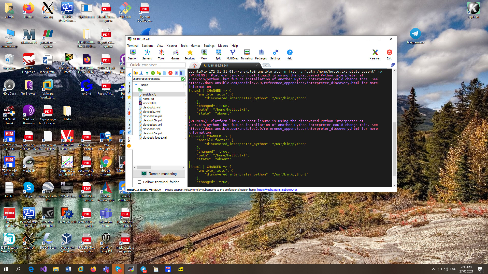
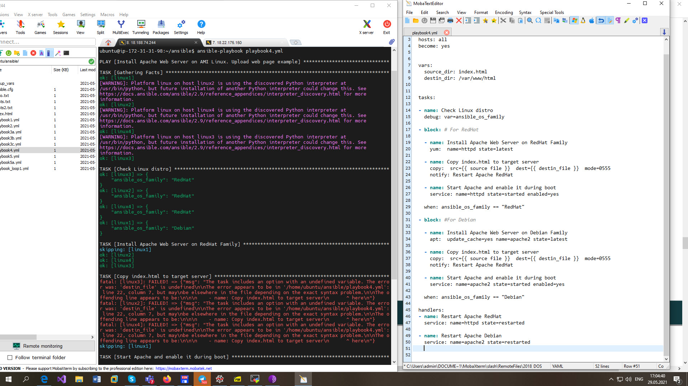

# EPAM University Programs

# DevOps external course

# Module 10  10 Configuration Manager Ansible

# TASK 10.1

Ansible configuration.

[ansible.cfg](./ansible.cfg)

AWS instances is created. Connection to hosts is verified.

Ansible ad-hoc commands.

`ansible-inventory --list` command used to display or dump the configured inventory as Ansible sees it.
Output all hosts info, works as inventory script.

`ansible-inventory --graph` create inventory graph, if supplying pattern it must be a valid group name.

`ansible staging -m setup` 

`ansible all -m shell -a uptime` 

`ansible all -m shell -a "ls /home"`

`ansible all -m copy -a "src=hello.txt dest=/home"`

`ansible all -m copy -a "src=hello.txt dest=/home" -b`

`ansible all -m copy -a "src=hello.txt dest=/home" -b`

`ansible all -m shell -a "ls -la /home"`

`ansible all -m copy -a "path=/home/hello.txt state=absent" -b`

`ansible all -m yum -a "name=httpd state=latest" -b`

`ansible test -m service -a "name=httpd state=started enabled=yes" -b`

`ansible production -m yum -a "name=httpd state=removed" -b`

make info more structured using groups_var

Task: Test connection to all servers, owned by your organization.
Assumed, that you have credentials to do this action

[playbook1.yml](./playbook1.yml) results.

Task: Install Apache Web Server on all servers, owned by your organization.
Also needed to start Apache Web Server and enable it during boot.

[playbook2.yml](./playbook2.yml) results.

Task: Install Apache Web Server on all servers, owned by your organization.
Also needed to start Apache Web Server and enable it during boot.
Also needed to change default index.html.

[playbook3.yml](./playbook3a.yml) results.

[playbook3b.yml](./playbook3b.yml) results.

`ansible all -m yum -a "name=httpd state=removed"`

Task: Install Apache Web Server on all servers, owned by your organization.
Also needed to start Apache Web Server and enable it during boot.
Also needed to change default index.html. Servers are on different Linux-based OS.

[playbook3b.yml](./playbook3b.yml) results. 

Task: Install Apache Web Server on all servers, owned by your organization.
Also needed to start Apache Web Server and enable it during boot.
Also needed to change default index.html. Servers are on different Linux-based OS.

[playbook3.yml](./playbook3b.yml) results.

Task: Install Apache Web Server on all servers, owned by your organization.
Also needed to start Apache Web Server and enable it during boot.
Also needed to change default index.html. Servers are on different Linux-based OS.

[playbook3c.yml](./playbook3c.yml) results.

Task: Install Apache Web Server on all servers, owned by your organization.
Also needed to start Apache Web Server and enable it during boot.
Also needed to change default index.html. Servers are on different Linux-based OS

[playbook4.yml](./playbook4.yml) results.

[playbook_loop1.yml](./playbook_loop1.yml) results.

Task: Make some actions on remote server,
Results should be viewed by output console

[playbook_loop1.yml](./playbook_loop1.yml) 

Task: Copy WebPage (some files) to remote server using loop.

[playbook5.yml](./playbook5.yml) results.

Task: Customize WebPage on remote servers using
template and jinja.

[playbook5a.yml](./playbook5a.yml) results.

`deploy_apache` ansible role is created.

Playbook [playbook5a.yml](./playbook5a.yml) is transformed to [deploy_apache](./deploy_apache) role.

Playbook for playing role is created.

