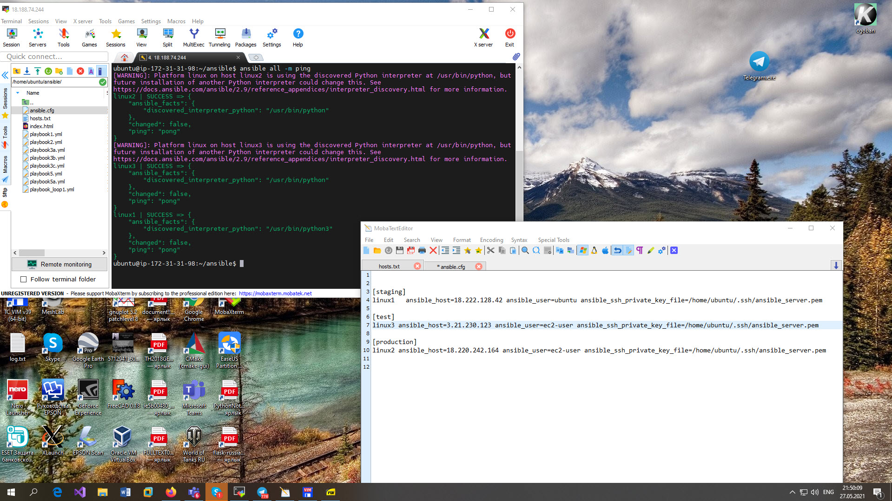
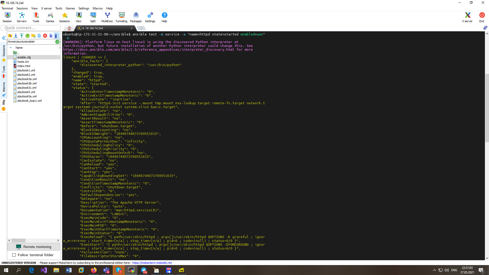

# EPAM University Programs

# DevOps external course

# Module 10  10 Configuration Manager Ansible

# TASK 10.1

Playbooks:

[playbook1.yml](./playbook1.yml)

[playbook2.yml](./playbook2.yml)

[playbook3a.yml](./playbook3a.yml)

[playbook3b.yml](./playbook3b.yml)

[playbook3c.yml](./playbook3c.yml)

[playbook4.yml](./playbook4.yml)

[playbook5.yml](./playbook5.yml)

[playbook5a.yml](./playbook5a.yml)

Ansible configuration.

[ansible.cfg](./ansible.cfg)

