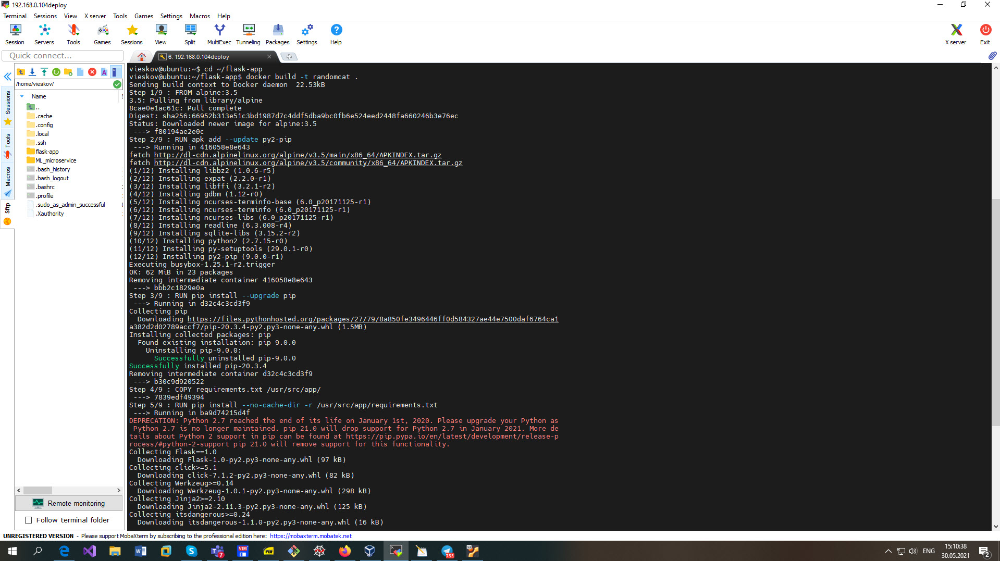
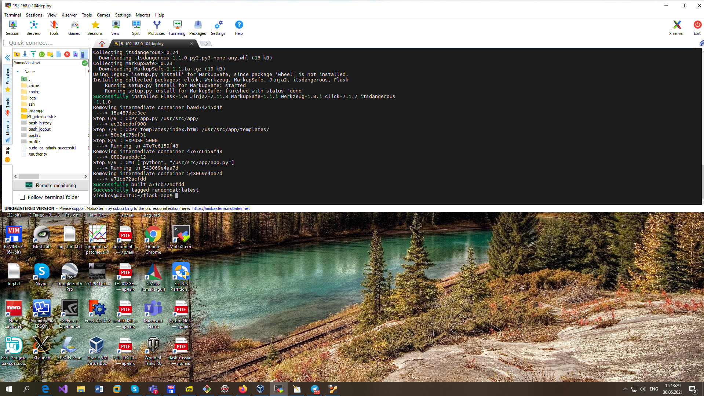
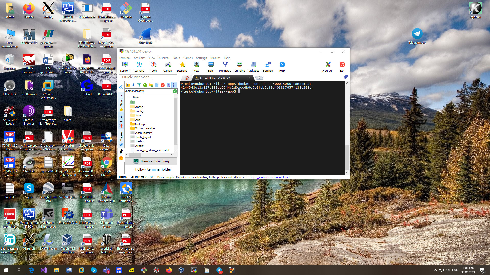
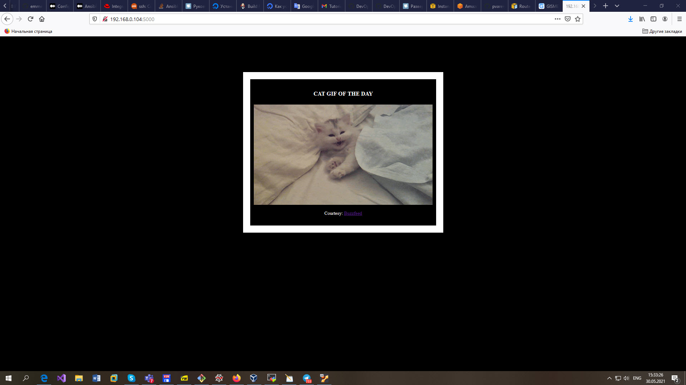

# EPAM University Programs

# DevOps external course

# Module 11   Docker.

# TASK 10.1

Using docker lection2 create a docker image with Python Flask app that displays random cat pix.

Flask app folder: [flask-app](./flask-app)

Docker container with application is builded.

Docker container with application is run.

Application results.

Video demonstrate how applikation works.

