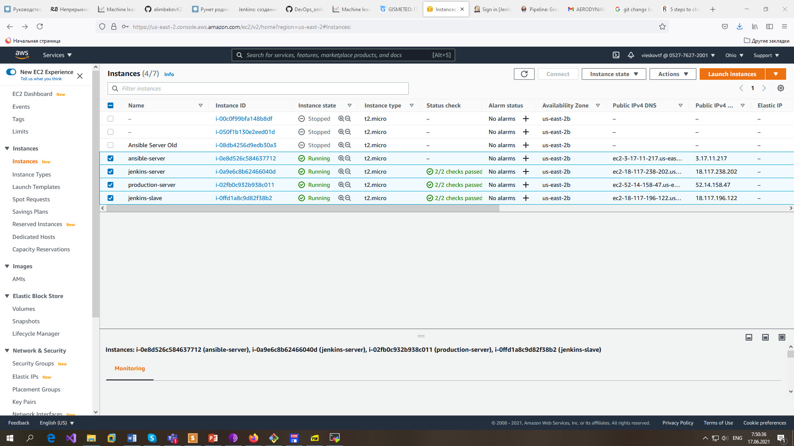
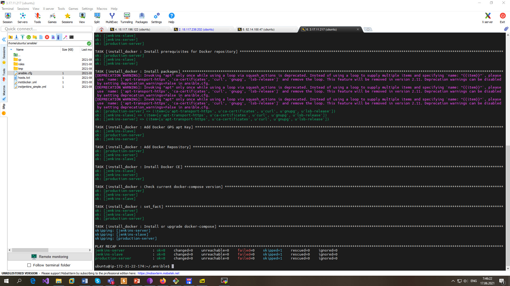
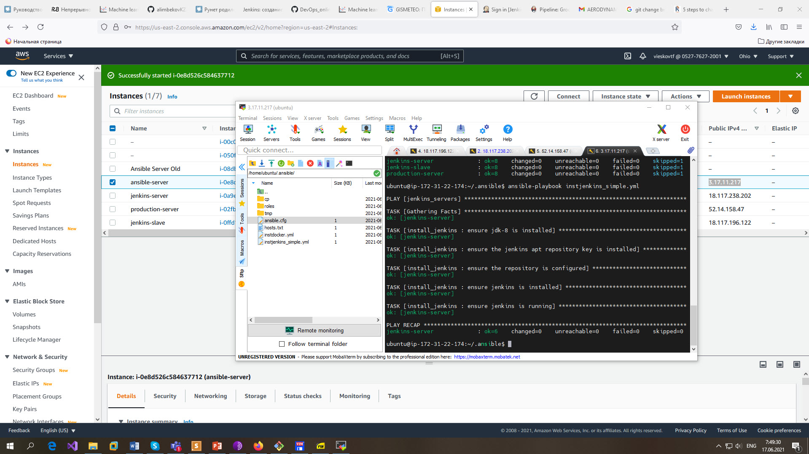
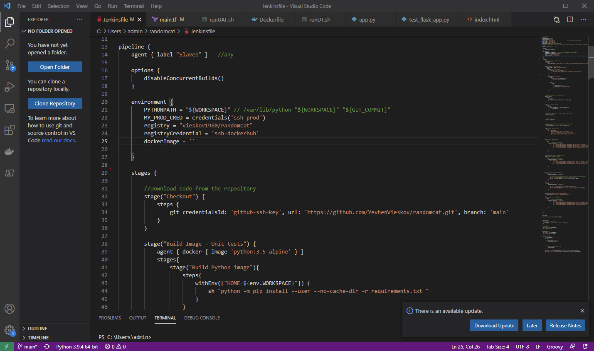
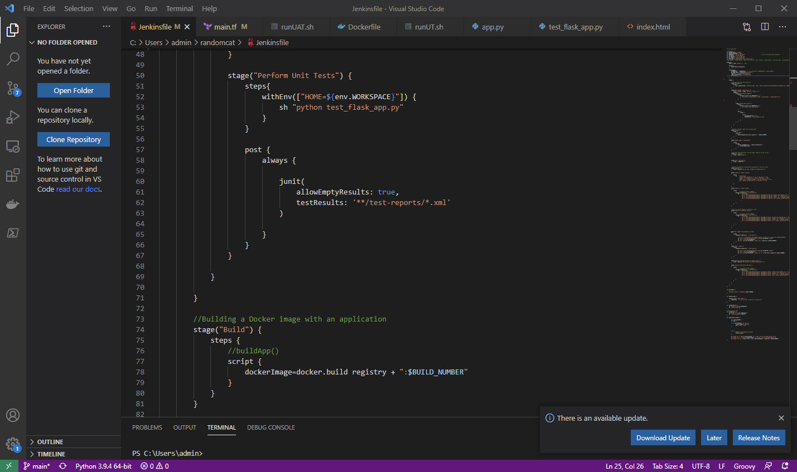
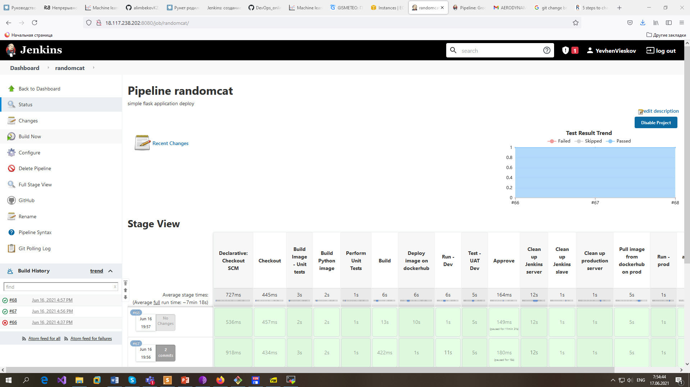

# EPAM University Programs

# DevOps external course

# Module 13   Project.

# TASK 13.1

Infrastracture is created by Terraform.

Terraform  file is in the folder [main.tf](./terraform/main.tf)

Infrastracture is configured by Ansible.

Ansible playbooks and roles is in the folder [ansible](./ansible)

CI/CD pipeline on GitHub [Jenkinsfile](https://github.com/YevhenVieskov/randomcat/blob/main/Jenkinsfile)

Project presentation  [DevOps_online_Dnipro_2021Q2_Yevhen_Vieskov.pptx](./DevOps_online_Dnipro_2021Q2_Yevhen_Vieskov.pptx)

