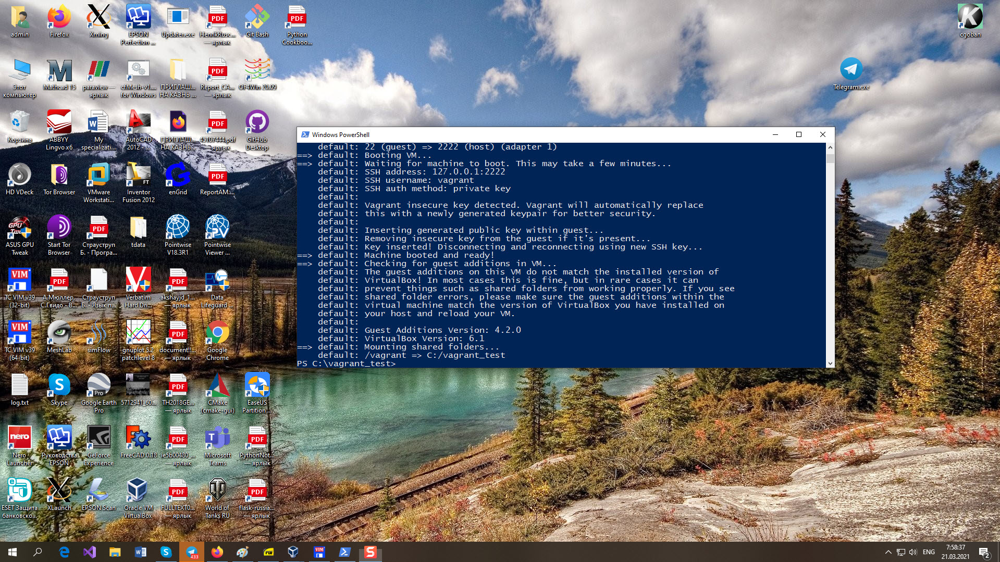

# TASK 2.1
## PART 1. HYPERVISORS
1. What are the most popular hypervisors for infrastructure virtualization?
   The most popular hypervisors for infrastructure virtualization is a Citrix XenServer, 
   VMware ESX Server, VMWare Workstation, Microsort Hyper-V, Oracle Virtual Box
2. Briefly describe the main differences of the most popular hypervisors.
   The main difference between hypervisors is the type of architecture: 
   type 1 it runs as a control program directly on the hardware side of the computer; 
   type 2 it runs on the host operating system; 
   type 3 - the monolithic hypervisor includes hardware device drivers;
   type 4 - the microkernel, device drivers are located inside the host operating system
   
## PART 2. WORK WITH VIRTUALBOX
1. First run VirtualBox and Virtual Machine (VM).
1.1 Get acquainted with the structure of the user manual VirtualBox [1] (see list of
references in the end of the document)
1.2 From the official VirtualBox site [2] download the latest stable version of
VirtualBox according to the host operating system (OS) installed on the student's
workplace. For Windows, the file may be called, for example,
VirtualBox-6.1.10-138449-Win.exe. Install VirtualBox.     
1.2 Download the latest stable version of Ubuntu Desktop or Ubuntu Server from
the official site [3].
    
1.3 Create VM1 and install Ubuntu using the instructions [1, chapter 1.8]. Set machine
name as "host machine name"_"student last name"
      
1.4 Get acquainted with the possibilities of VM1 control - start, stop, reboot, save state,
use Host key and keyboard shortcuts, mouse capture, etc. [1, ch.1.9].
      
1.5 Clone an existing VM1 by creating a VM2 [1, ch.1.14].
     
1.6 Create a group of two VM: VM1, VM2 and learn the functions related to groups [1,
ch.1.10].
      
1.7 For VM1, changing its state, take several different snapshots, forming a branched
tree of snapshots [1, ch.1.11].
      
1.8 Export VM1. Save the *.ova file to disk. Import VM from *.ova file [1, ch.1.15].
      
2. Configuration of virtual machines
2.1 Explore VM configuration options (general settings, system settings, display,
storage, audio, network, etc.).
     
2.2 Configure the USB to connect the USB ports of the host machine to the VM
[1, ch.3.11].
      
2.3 Configure a shared folder to exchange data between the virtual machine and
the host [1, ch.4.3].
      
2.4 Configure different network modes for VM1, VM2. Check the connection
between VM1, VM2, Host, Internet for different network modes. You can use the ping
command to do this. Make a table of possible connections.

**Connection table**

Network type VM1    | localhost |internet |	VM2 NAT | VM2 netbridge | VM2 Etternet |	VM2 Host-only Ethernet 
--------------------|-----------|---------|---------|---------------|--------------|--------------------------
NAT	                |     T	    |    T	  |    F	|     F	        |       F	   |            F
netbridge	        |     T	    |    F	  |    F	|     F	        |       F	   |            F
Ethernet	        |     T	    |    F	  |    F	|     F	        |       F	   |            F
Host-only Ethernet	|     T	    |    F	  |    F	|     F	        |       F	   |            F

3. Work with CLI through VBoxManage.
3.1 Run the cmd.exe command line.
3.2 Examine the purpose and execute the basic commands of VBoxManage list,
showvminfo, createvm, startvm, modifyvm, clonevm, snapshot, controlvm [1, ch.8].
    
## PART 3. WORK WITH VAGRANT
1. Download the required version of Vagrant according to the instructions [5] and
according to the host operating system (OS) installed on the student's workplace. For
Windows, the file may be called, for example, vagrant_2.2.0_x86_64.msi. Install Vagrant.
Check the path to Vagrant bin in the Path variable (My computer -> Properties ->
Advanced system settings -> Advanced -> Environment Variables).
      
2. Run the powershell. Create a folder "student name" (in English). In this example,
create a folder vagrant_test. Next, go to the folder.
      
3. Initialize the environment with the default Vagrant box:
init hashicorp/precise64
      
4. Run vagrant up and watch for messages during VM boot and startup.
      
5. Connect to the VM using the program PuTTY (can be downloaded from [6]),
using SSH, IP address and port listed above (127.0.0.1:2222). By default, login - vagrant
and password are also vagrant
     
6. Record the date and time by executing the date command
      
7. Stop and delete the created VM.
      
8. Create your own Vagrant box [7]
      
9. (optional) Create a test environment from a few servers. Servers' parameters
      
are chosen independently by the student.

## REFERENCES
1. Oracle VM VirtualBox.User Manual [title] (https://www.virtualbox.org/manual/)
2. Official page VirtualBox [title] (https://www.virtualbox.org/)
3. Download page Ubuntu [title] (https://ubuntu.com/download)
4. Documentation page Vagrant [title] (https://www.vagrantup.com/docs/index.html)
5. Installation instructions page Vagrant
[title] (https://www.vagrantup.com/docs/installation/index.html)
6. Download page PuTTY [title] (https://www.putty.org/)
7. O’Reilly - Vagrant: Up and Running.
8. Vagrant Workflows [title] (http://czerasz.com/2015/01/06/vagrant-workflows/)
9. How To Use Vagrant To Create Small Virtual Test Lab on a Linux / OS X / MS-
Windows [title] (https://www.cyberciti.biz/cloud-computing/use-vagrant-to-create-small-
virtual-lab-on-linux-osx/)
