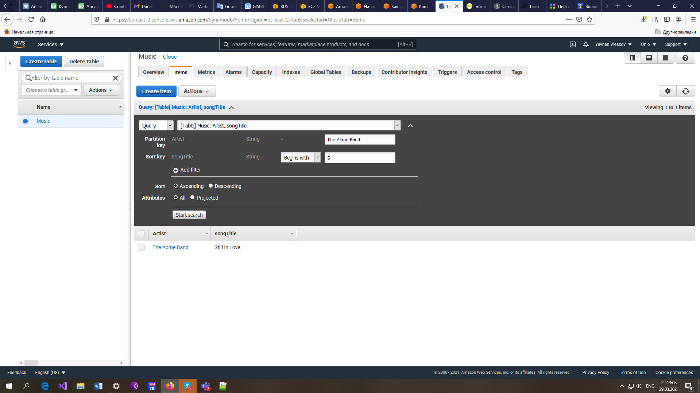

# EPAM University Programs
# DevOps external course
# Module 3 Database Administration
# TASK 3.1
## PART 1
1. Download MySQL server for your OS on VM.
2. Install MySQL server on VM.
   
3. Select a subject area and describe the database schema, (minimum 3 tables)
   Subject area is a bookstore. The database schema consists of tables containing 
   information about customers, books, thematic categories of books, orders, 
   number of books in order, database administrators.
   'Customers(CustomerID, Name, Address, City, State, Zip, Country)
    Categories(CatID, Catname)
    Books(ISBN, Author, Title, CatID, Price, Description)
    Orders(OrderlD, CustomerID, Amount, Date, Order_Status, Ship_Name, 
	       Ship_Address, Ship_City, Ship_State, Ship_Zip, Ship_Country)    
    Order_Items (OrderID, ISBN, Item_Price, Quantity)'  
    Admin(Username, Password)
	
4. Create a database on the server through the console.
   The database is created by the following command:
    'source /path/book_sc.sql'   
	[book_sc.sql](./book_sc.sql)
5. Fill in tables.
   Table is filled by the following command:
   'source /path/populate.sql' 
   [book_sc.sql](./populate.sql)
6. Construct and execute SELECT operator with WHERE, GROUP BY and ORDER BY.
   SELECT operators is executed by the following command:
   'source /path/book_select.sql' 
   [book_sc.sql](./book_select.sql)
7. Execute other different SQL queries DDL, DML, DCL.
   Different SQL queries is executed by the following command:
   'source /path/book_select.sql' 
   [book_sc.sql](./book_select.sql)
   Link to file with results:[book_sc.log](./book_sc.log)  
8. Create a database of new users with different privileges. Connect to the database  
   as a new user and verify that the privileges allow or deny certain actions.
   Database new_users and three users with different privileges is created [new_users.sql](./new_users.sql)
   File with test queries: [new_users_queries.sql](./new_users_queries.sql)    
   Test results:  [new_users_test_res.log](./new_users_test_res.log)      
9. Make a selection from the main table DB MySQL.
   Selection from the main table DB MySQL is created: [select_dbmysql.sql](./select_dbmysql.sql)
   Selection results: [select_dbmysql.log](./select_dbmysql.log)

## PART 2
10. Make backup of your database.
    Backup database `book_sc` is created: [book_sc_dump.sql](./book_sc_dump.sql), [book_sc_dump_restore.log](./book_sc_dump_restore.log) 
11. Delete the table and/or part of the data in the table.
    Table `Customers` is deleted: [book_sc_dump_restore.log](./book_sc_dump_restore.log) 
12. Restore your database.
    Database `book_sc` is restored: [book_sc_dump_restore.log](./book_sc_dump_restore.log) 
13. Transfer your local database to RDS AWS.
    Database dump is copied to AWC EC2 instance:
	
	[mysql_rds.log](./mysql_rds.log) 
14. Connect to your database.
    Connection is created: [mysql_rds.log](./mysql_rds.log) 
15. Execute SELECT operator similar step 6.
    SELECT operator is executed: [mysql_rds.log](./mysql_rds.log) 
    
16. Create the dump of your database.
    Database dump is created: [mysql_rds.log](./mysql_rds.log) 

## PART 3
    
17. Create an Amazon DynamoDB table
    Amazon DynamoDB table is created:
		
18. Enter data into an Amazon DynamoDB table.
    Table is filled:
		
19. Query an Amazon DynamoDB table using Query and Scan.
    	
		
		
