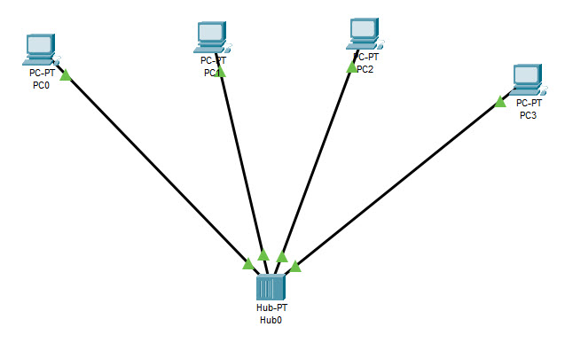
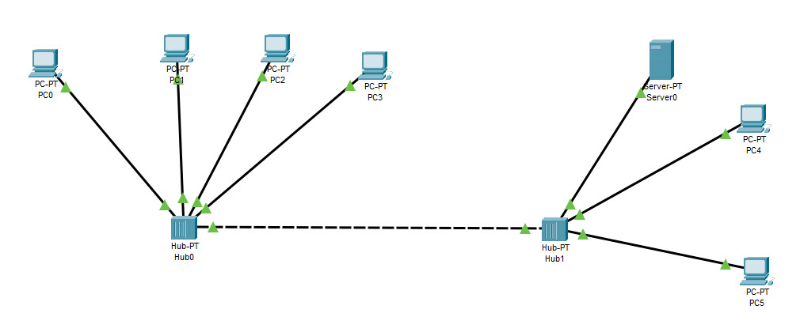
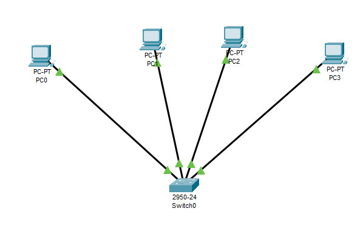
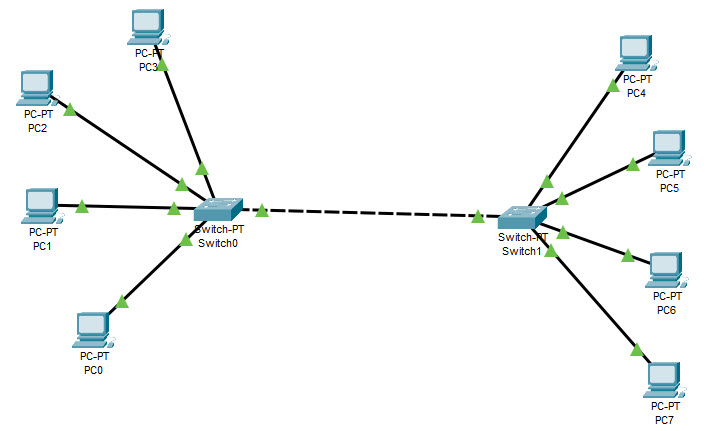
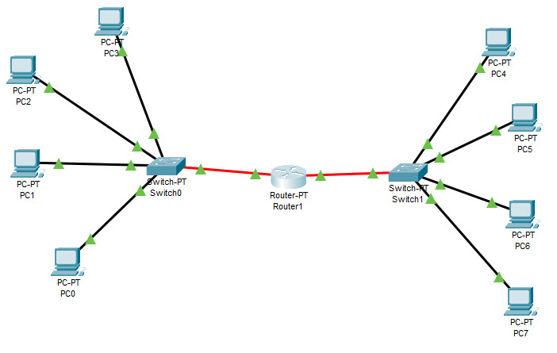

# EPAM University Programs
# DevOps external course
# Module 4 Networking Fundamentals
# TASK 4.1
1. Assemble the following project (Fig. 1), which contains: 4 PC type PC-
PT, Hub-PT. Every computer must be connected to
concentrator with twisted pair (Copper Straight-through).

Figure 1 - Topology 1
2. Save the project and its screenshot.
3. Assign a unique IP address to each PC. For its purpose
you need to go to the PC configuration menu by clicking once on
left-click it and select the Config / Interface tab. In the field ip
address you must enter the appropriate address, and in the Subnet Mask field - accordingly
this address mask 
The values ​​of the IP address for each machine are given in the table:
| Name| IP-address  |
|:---:|:-----------:|
| PC0 | 192.168.0.1 |
| PC1 | 192.168.0.2 |
| PC2 | 192.168.0.3 |
| PC3 | 192.168.0.4 |
The value of the mask for the address: 255.255.255.0.
4. Check the performance of the received network by implementation
Internet requests (ICMP packets) from one PC to another. For assignment
For such a PC package, use the ADD SIMPLE PDU button on the right
working window. Then left-click on the local one
the source machine, then the recipient machine. Check performance
network.
5. Switch to Simulation mode and use the Event List button
call the window to display events in the Simulation Panel network.
Use the Auto Capture / Play button to start the simulation
ICMP packet operation. Track the promotion of packets over the network and save
this screenshot.
6. Follow the order and path of packets in the window
Simulation Panel. Save this screenshot.
7. View information about packages from the Simulation Panel window and them
matching the OSI model by double-clicking on the package in the window. 
Save the results as a screenshot.
Network is worked.

Cisko PacketTracer Project: [task4.1.1.pkt](./task4.1.1.pkt).

Network video:  [task4.1.1.mp4](./task4.1.1.mp4)).

A layer 1 network device such as a hub transfers data but does not manage 
any of the traffic coming through it. Any packet entering a port is repeated 
to the output of every other port except for the port of entry. Specifically, 
each bit or symbol is repeated as it flows in. A repeater hub can therefore only 
receive and forward at a single speed. Dual-speed hubs internally consist of two 
hubs with a bridge between them. Since every packet is repeated on every other port, 
packet collisions affect the entire network, limiting its overall capacity. 

8. Delete the IP address from each local machine PC0 - PC3.
Repeat steps 5 - 10. Analyze the differences in the network.
Еhe network is inoperative without ip addresses
 
Cisko PacketTracer Project: [task4.1.8.pkt](./task4.1.8.pkt).

Network video:  [task4.1.8.mp4](./task4.1.8.mp4).

9. Assemble the next project. It includes: PC0-PC5, Server,
    2 Hubs. Devices of the same name are connected by a crossover cable
(Copper Cross-over).

Figure 2 - Topology 2
10. Assign an IP address to each network component from the following
table:
| Name| IP-address  |
|:---: |:--------------:|
| PC0  |   192.168.0.1 |
| PC1  |   192.168.0.2 |
| PC2  |   192.168.0.3 |
| PC3  |   192.168.0.4 |
| PC4  |   192.168.0.6 |
| PC5  |   192.168.0.7 |
| Server | 192.168.0.5 |
The value of the mask for the address: 255.255.255.0.
11. Check the network performance.
The network is operational 

Cisko PacketTracer Project: [task4.1.9.pkt](./task4.1.9.pkt).

Network video:  [task4.1.9.mp4](./task4.1.9.mp4).

12. Create a new project, which includes: 4 PCs such as PC-PT,
Switch. Every computer must be connected to
concentrator with twisted pair (Copper Straight-through) (Fig.
6).

Figure 3 - Topology 3
13. For this topology, repeat steps 3-9. Analyze
differences in the operation of the network Topology 1 and Topology 3.
Unlike repeater hubs, which broadcast the same data out of each port and
let the devices pick out the data addressed to them, a network switch learns 
the identities of connected devices and then only forwards data to the port 
connected to the device to which it is addressed

Cisko PacketTracer Project: [task4.1.12.pkt](./task4.1.12.pkt)

Network video:  [task4.1.12.mp4](./task4.1.12.mp4)

14. Expand the project to this form (Fig. 4). It includes: 8 PCs
type PC-PT, 2 switches (Switch). Each computer must be connected
with the switch by means of twisted pair (Copper Straight-through),
switches are interconnected by a crossover cable (Copper
Cross-over).

15. If necessary, add additional ports to the switches. For this
you need to drag each of them in the Physical / MODULES tab
the Ethernet port is available in the empty slot by first turning off the switch
using the power button.

Figure 4 - Topology 4

16. Assign an IP address to each network component from the following
tables:
| Name| IP-address  |
|:---:|:-----------:|
| PC0 | 192.168.0.1 |
| PC1 | 192.168.0.2 |
| PC2 | 192.168.0.3 |
| PC3 | 192.168.0.4 |
| PC4 | 192.168.0.5 |
| PC5 | 192.168.0.6 |
| PC6 | 192.168.0.7 |
| PC7 | 192.168.0.8 |
The value of the mask for the address: 255.255.255.0.
17. Check the network performance.
The network is operational 

Cisko PacketTracer Project: [task4.1.14.pkt](./task4.1.14.pkt)

Network video:  [task4.1.14.mp4](./task4.1.14.mp4)

18. Divide the existing network into two subnet levels. And connect them by
using a Router-PT router with multiple ports (Fig. 5).
Connect the router and switches together using fiber optics
(Fiber).

Figure 5 - Topology 5
19. Assign IP addresses to PC4 - PC7 computers from the following
tables:
| Name| IP-address  |
|:---:|:------------:|
| PC4 |  192.168.1.1 |
| PC5 |  192.168.1.2 |
| PC6 |  192.168.1.3 |
| PC7 |  192.168.1.4 |
The value of the mask remains the same: 255.255.255.0.
20. Router ports should be enabled (On) and assigned an IP
addresses in the range of the selected subnet.
21. On each of the computers (PC0 - PC7) it is necessary to mark the gateway.
To assign it, go to the Desktop / Ip Configuration menu and
in the Default Gateway field, enter the port address of the router through which to
it connects the subnet that includes this PC.
22. Check the network.
23. Analyze the differences in the network Topology 4 and Topology
     5. Evaluate the opportunities provided by the use of the router. 
	 
Cisko PacketTracer Project: [task4.1.18.pkt](./task4.1.18.pkt).

Network video:  [task4.1.18.mp4](./task4.1.18.mp4).

A router is connected to two or more data lines from different IP networks.
When a data packet comes in on one of the lines, the router reads the network 
address information in the packet header to determine the ultimate destination. 
Then, using information in its routing table or routing policy, it directs the 
packet to the next network on its journey. 
