# EPAM University Programs
# DevOps external course
# Module 5 05 Linux Essential
# TASK 5.2

## Task assignment.
1) Analyze the structure of the /etc/passwd and /etc/group file, what fields are
present in it, what users exist on the system? Specify several pseudo-users, how
to define them?

etc/passwd

etc/passwd file stores essential information, which required during login.
In other words, it stores user account information. The /etc/passwd is a plain text file. 
It contains a list of the system’s accounts, giving for each account some useful information 
like user ID, group ID, home directory, shell, and more. The /etc/passwd file should have 
general read permission as many command utilities use it to map user IDs to user names. 
However, write access to the /etc/passwd must only limit for the superuser/root account. 

Username: It is used when user logs in. It should be between 1 and 32 characters in length.
Password: An x character indicates that encrypted password is stored in /etc/shadow file.
Please note that you need to use the passwd command to computes the hash of a password
typed at the CLI or to store/update the hash of the password in /etc/shadow file.
User ID (UID): Each user must be assigned a user ID (UID). UID 0 (zero) is reserved
for root and UIDs 1-99 are reserved for other predefined accounts. 
Further UID 100-999 are reserved by system for administrative and system accounts/groups.

Pseudo-users. Each of the UNIX variants contains pseudo-user description lines in the
password file. These descriptions are never edited. Users of these names are not registered in
the system and are only needed to confirm ownership of the processes. The most used are:

daemon - Used by system service processes

bin - Gives ownership of executables command

adm - Owns registration files

nobody - Used by many services

sshd – used by the secure shell server.

Pseudo-users examples:

bin:x:1:1:bin:/bin:/sbin/nologin
daemon:x:2:2:daemon:/sbin:/sbin/nologin
adm:x:3:4:adm:/var/adm:/sbin/nologin
radvd:x:75:75:radvd user:/:/sbin/nologin
chrony:x:993:988::/var/lib/chrony:/sbin/nologin
qemu:x:107:107:qemu user:/:/sbin/nologin

etc/group

Group ID (GID): The primary group ID (stored in /etc/group file)
User ID Info: The comment field. It allow you to add extra information about the
users such as user’s full name, phone number etc. This field use by finger command.
Home directory: The absolute path to the directory the user will be in when
they log in.
If this directory does not exists then users directory becomes /
Command/shell: The absolute path of a command or shell (/bin/bash).
Typically, this is a shell. Please note that it does not have to be a shell.
For example, sysadmin can use the nologin shell, which acts as a replacement
shell for the user accounts. If shell set to /sbin/nologin and the user tries
to log in to the Linux system directly, the /sbin/nologin shell closes the connection.

2) What are the uid ranges? What is UID? How to define it?
A UID (user identifier) is a number assigned by Linux to each user on the system.
This number is used to identify the user to the system and to determine which system
resources the user can access. UIDs are stored in the /etc/passwd file: The third field 
represents the UID.  UID 0 (zero) is reserved for the root. 
UIDs 1–99 are reserved for other predefined accounts. UIDs from 100 to 499 should
be reserved for dynamic allocation by system administrators and 
post install scripts.
Some POSIX systems allocate UIDs for new users starting from 500 (macOS, Red Hat Enterprise Linux
till version 6), others start at 1000 (Red Hat Enterprise Linux since version 7, openSUSE, Debian).
On many Linux systems, these ranges are specified in /etc/login.defs, for useradd and similar tools.

3) What is GID? How to define it?
A group identifier, often abbreviated to GID, is a numeric value used to represent a specific group.
The range of values for a GID varies amongst different systems; at the very least, a GID can be between 0
and 32,767, with one restriction: the login group for the superuser must have GID 0. This numeric value is
used to refer to groups in the /etc/passwd and /etc/group files or their equivalents. Shadow password files
and Network Information Service also refer to numeric GIDs. The group identifier is a necessary component of
Unix file systems and processes. 

4) How to determine belonging of user to the specific group?

Enter the following command in order to see which group the current user belongs to:

`groups`

This command lists all the groups that you belong to.

Enter the following command to check which group a certain user belongs to:

`groups username`

You can also use the following command to list the group members along with their GIDs.

`id username`

To find a user's UID or GID in Unix, use the id command. To find a specific user's UID, at the Unix prompt, enter:

 `id -u username`

Replace username with the appropriate user's username. To find a user's GID, at the Unix prompt, enter:

 `id -g username`

If you wish to find out all the groups a user belongs to, instead enter:

 `id -G username`

If you wish to see the UID and all groups associated with a user, enter id without any options, as follows:

 `id username`

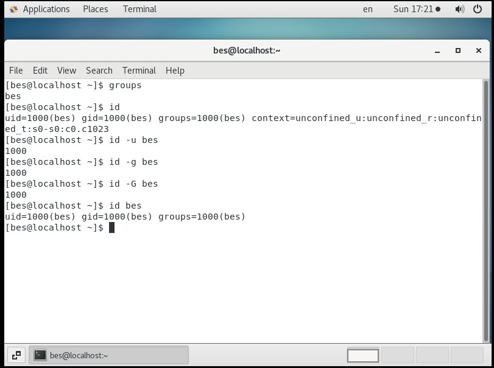

5) What are the commands for adding a user to the system? What are the basic
parameters required to create a user?

The basic command to create a user (named test) would be:

`useradd test`

You'll need privileges to /etc/password to do this; as such, you'll likely sudo the above command:

To set a user's password: Use `passwd test` and to switch users, use the `su  test` command.

Based on the /etc/defaults/useradd file, the user may or may not have been assigned a home 
directory based on the settings file.

To force the creation of a home directory, use the following command:

`sudo useradd -m test`

The above command creates a /home/test folder for the user test. 

If you want the user to have a home folder in a different place than the default, use the -d switch.

`sudo useradd -m -d /test test`

The above command creates a folder called test for user test under the root folder. 

To set an expiry date when creating a user, use the following command:

`sudo useradd -m -e 2021-04-25 test`

The date must be specified in the format YYYY-MM-DD where YYYY is the year, MM is the
month number, and DD is the day number.

The following command would add john to the accounts group.

`sudo useradd -g accounts john` 

The following example shows how to create a user with a password warning, a maximum number of
days before the password expires, and login-retries set.

`sudo useradd -m -K PASS_MAX_DAYS=5 -K PASS_WARN_AGE=3 -K LOGIN_RETRIES=3 test `

To create a user without a home folder regardless of the settings, use the following command:

`sudo useradd -M test` 

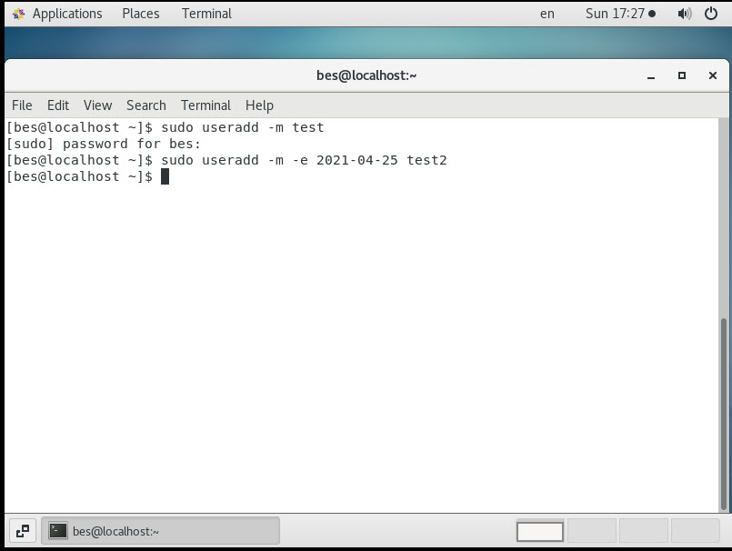

6) How do I change the name (account name) of an existing user?

To change username (it is probably best to do this without being logged in):

`sudo usermod -l newUsername oldUsername`

This however, doesn't rename the home folder.

To change home-folder, use

`sudo usermod -d /home/newHomeDir -m newUsername`

after you changed the username.

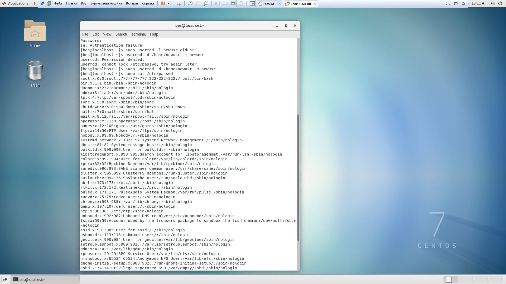

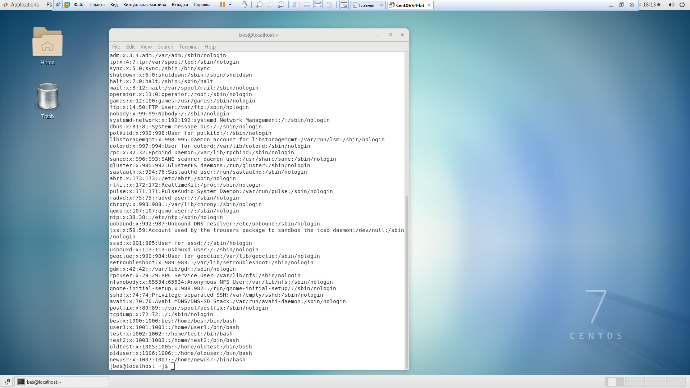

7) What is skell_dir? What is its structure?
Directory /etc/skel/ (skel is derived from the “skeleton”) is used to initiate home directory when 
a user is first created. skell_dir  contains files which must be copied to the new user's home directory.
A sample layout of “skeleton” user files is as shown below:

`ls -lart /etc/skel`

Below is a sample /etc/defualt/useradd file which defines the skel directory. You can change the default
location /etc/skel to any other location.
cat /etc/default/useradd

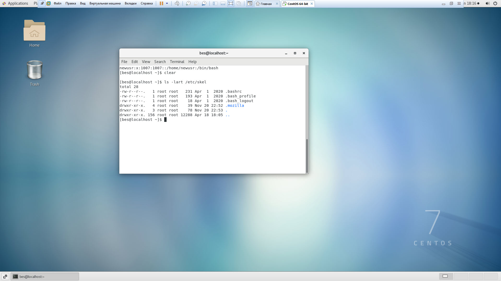

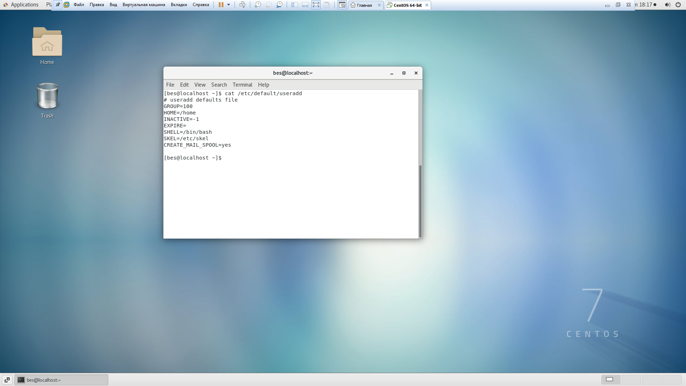

8) How to remove a user from the system (including his mailbox)?

Next, delete the user’s home directory and mail spool pass the -r option to userdel for a user named user_name, enter:
`userdel -r user_name`

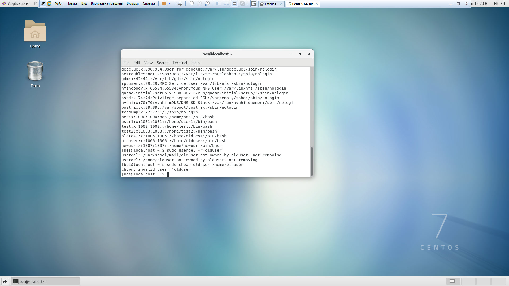

9) What commands and keys should be used to lock and unlock a user account?

To lock a users account use the command `usermod -L` or `passwd -l`. Both the commands
adds an exclamation mark (“!”) in the second field of the file /etc/passwd. For example :
`usermod -L testuser`
`passwd -l testuser`

To unlock a users account use the command `usermod -U` or `passwd -u`.

`usermod -U testuser`
`passwd -u testuser`

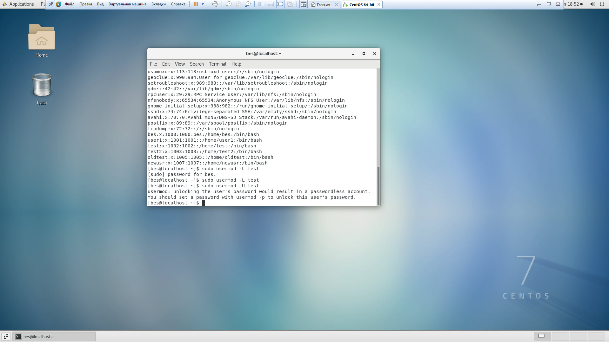

10) How to remove a user's password and provide him with a password-free
login for subsequent password change?

1.First, if your user has sudo privileges, you must enable its NOPASSWD option.
Otherwise, sudo will ask for a password even when you don't have one, and won't
accept an empty password.

To do so, open the sudoers configuration file with `sudo visudo`, and add the following
line to the file, replacing `user_name` with your username:

`user_name ALL=(ALL) NOPASSWD:ALL`

Close the editor to apply the changes, and test the effect on sudo in a new terminal.

Delete the password for your user by running this command:

`sudo passwd -d `whoami``

If you ever get prompted for a password, just type enter and it should work.

By default, passwords are set to never expire. To force a user to change their
password the next time they log in, use the passwd command with --expire option
followed by the username of the user:

`sudo passwd --expire linuxize`

The command above will immediately expire the user password.

Alternatively, you can use the chage command, with the -d or --lastday option which
sets the number of days since January 1st, 1970 when the password was last changed.

Now to set the password expiry of user, run the following command by specifying the
day to zero (0), means that the password has not been changed since the above date
(i.e. January 1st, 1970), so the password has literally expired and needs to be
changed immediately before the user can access the system again.

`chage --lastday 0 user_name`
OR
`chage --lastday 1970-01-01 user_name`

11) Display the extended format of information about the directory, tell about
the information columns displayed on the terminal.

The default output of the ls command shows only the names of the files and directories,
which is not very informative.

The -l ( lowercase L) option tells ls to print files in a long listing format.

When the long listing format is used, you can see the following file information:

The file type.
The file permissions.
Number of hard links to the file.
File owner.
File group.
File size.
Date and Time.
File name.

Here is an example:

`ls -l ~`

`-rw-r--r--. 1 root root   913207 Apr 12 01:29 dirinfo.txt`

Let’s explain the most important columns of the output.

The first character shows the file type. In this example,
the first character is -, which indicates a regular file.
Values for other file types are as follows:

    - - Regular file.
    b - Block special file.
    c - Character special file.
    d - Directory.
    l - Symbolic link.
    n - Network file.
    p - FIFO.
    s - Socket.

The next nine characters are showing the file permissions.
The first three characters are for the user,
the next three are for the group, and the last three are for others.
You can change the file permissions with the chmod command.
The permission character can take the following value:

    r - Permission to read the file.
    w - Permission to write to the file.
    x - Permission to execute the file.
    s - setgid bit.
    t - sticky bit.

In our example, rw-r--r-- means that the user can read and write
the file, and the group and others can only read the file.
The number 1 after the permission characters is the number
of hard links to this file.

The next two fields root root are showing the file owner
and the group, followed by the size of the file (337), shown
in bytes. Use the -h option if you want to print sizes in a
human-readable format. You can change the file owner using the chown command.

Apr 12 01:29 is the last file modification date and time.

12) What access rights exist and for whom (i. e., describe the main roles)?
Briefly describe the acronym for access rights.

Every file and directory on your Unix/Linux system is assigned 3 types of owner, given below.

**User**

A user is the owner of the file. By default, the person who created a file becomes its owner.
Hence, a user is also sometimes called an owner.

**Group**

A user- group can contain multiple users. All users belonging to a group will have the same
Linux group permissions access to the file. Suppose you have a project where a number of
people require access to a file. Instead of manually assigning permissions to each user,
you could add all users to a group, and assign group permission to file such that only
this group members and no one else can read or modify the files.

**Other**

Any other user who has access to a file. This person has neither created the file, nor he
belongs to a usergroup who could own the file. Practically, it means everybody else. Hence,
when you set the permission for others, it is also referred as set permissions for the world.

Now, the big question arises how does Linux distinguish between these three user types so that
a user 'A' cannot affect a file which contains some other user 'B's' vital information/data.
It is like you do not want your colleague, who works on your Linux computer, to view your images.
This is where Permissions set in, and they define user behavior.

Let us understand the Permission system on Linux.

**Permissions**

Every file and directory in your UNIX/Linux system has following 3 permissions defined for all the 3 owners discussed above.

*Read: This permission give you the authority to open and read a file. Read permission on a directory gives you the ability to lists its content.
*Write: The write permission gives you the authority to modify the contents of a file. The write permission on a directory gives you the authority to add, remove and rename files stored in the directory. Consider a scenario where you have to write permission on file but do not have write permission on the directory where the file is stored. You will be able to modify the file contents. But you will not be able to rename, move or remove the file from the directory.
*Execute: In Windows, an executable program usually has an extension ".exe" and which you can easily run. In Unix/Linux, you cannot run a program unless the execute permission is set. If the execute permission is not set, you might still be able to see/modify the program code(provided read & write permissions are set), but not run it.

`-rwx rwx rwx. 1 root root   913207 Apr 12 01:29 dirinfo.txt`

The next nine characters are showing the file permissions.
The first three characters are for the user,
the next three are for the group, and the last three are for others.
You can change the file permissions with the chmod command.
The permission character can take the following value:

    r - Permission to read the file.
    w - Permission to write to the file.
    x - Permission to execute the file.
    s - setgid bit.
    t - sticky bit.

13) What is the sequence of defining the relationship between the file and the
user?

A Linux user (process) in relation to any file can act in three roles: as the owner (user),
as a member of the group that the file belongs to (group), and as an other (other), who
does not have any ownership relations for this file. The attribute string is the three rwx
triples describing the file permissions of the owner of this file (the first triple, "u"),
the group that owns the file (the second triple, "g") and outsiders (the third triple, "o") ...
If a letter is missing in any triplet, and instead of it there is "-", then the user in the
corresponding role will be denied the corresponding type of access.

When clarifying the relationship between a file and the user who started the process, the role is determined as follows:

If the UID of the file is the same as the UID of the process, the user is the owner of the file

If the GID of the file matches the GID of any group the user belongs to, he is a member of the group to which the file belongs.

If neither the UID nor the GID of the file overlaps with the UID of the process and the list of groups that the user running it
belongs to, that user is an outsider.

It is in the role of the owner that the user (process) can change the shortcut of the file. The only thing that the owner
cannot do with his file is to change the owner for him.

Permissions are changed using three commands: chown (change owner), chgrp (change group), and chmod with an extended
parameter format: before the access part (before the "+" or "-" sign), can list the roles "u", "g", "o" and "a"
(all, which corresponds to "ugo") for which access is being changed. In addition, when specifying access, you can
use "=" instead of "+" and "-", then the specified access methods are allowed for the specified roles, and the
unspecified ones are denied. Instead of a pair of chown commands, the master is the file; chgrp file group can use one:
chown master: file group, which changes both the UID and GID of the file (directory, links, etc.) at the same time.

Determining the access rights of a process to a file system object (for example, a file) is as follows.
Using the process UID, the list of groups that include the user who started the process, the file UID and
the file GID, the system determines the process's role in relation to the file, and then refers to the
corresponding triplet of file attributes. The process cannot play several roles at once. 

14) What commands are used to change the owner of a file (directory), as well
as the mode of access to the file? Give examples, demonstrate on the terminal.

`chown` changes the user and/or group ownership of each given file.  If only
an  owner  (a user  name or numeric user ID) is given, that user is made the owner of
each given file, and the files' group is not changed.  If the owner  is
followed  by  a  colon  and a group name (or numeric group ID), with no
spaces between them, the group ownership of the  files  is  changed  as
well.  If a colon but no group name follows the user name, that user is
made the owner of the files and the group of the files  is  changed  to
that  user's  login  group.   If the colon and group are given, but the
owner is omitted, only the group of the files is changed; in this case,
chown  performs  the same function as chgrp.  If only a colon is given,
or if the entire operand is empty, neither the owner nor the  group  is
changed.

Switch to the super user and change the file owner as follows,

`chown nobody file1.txt `

The command chown can also be used to change the user and group of files and directories as
follows,

`chown user_name:group_name file_dir_name`

Let's change the owner of the dir1 folder to root: 

`chown root ./dir1`

If you want to change the owner and group of a directory or file at once, write down
them separated by a colon, for example, change the user and group for the dir2 directory to root: 

`chown root:root ./dir2`

If you want the changes to apply not only to this directory, but to all
its subdirectories, add the -R option: 

`chown -R root:root ./dir3`

chmod changes the file mode bits of
each given file according to mode, which can  be  either  a  symbolic  representation  of
changes to make, or an octal number representing the bit pattern for the new mode bits.

The  format  of  a  symbolic mode is [ugoa...][[+-=][perms...]...], where perms is either
zero or more letters from the set rwxXst, or a single letter from the set ugo.   Multiple
symbolic modes can be given, separated by commas.

A  combination  of  the  letters  ugoa  controls  which users' access to the file will be
changed: the user who owns it (u), other users in the file's group (g), other  users  not
in  the file's group (o), or all users (a).  If none of these are given, the effect is as
if a were given, but bits that are set in the umask are not affected.

The operator + causes the selected file mode bits to be added to the existing  file  mode
bits  of each file; - causes them to be removed; and = causes them to be added and causes
unmentioned bits to be removed except that a directory's unmentioned set user  and  group
ID bits are not affected.

Allow the owner to execute the script: 

`chmod u+x file`

Or you can use digital notation: 

`chmod 766 file`
`ls - l file`

The disadvantage of digital recording is that you cannot modify existing rights.
linux access. For example, in the first option, you simply added an execution flag for the owner
file, and all other rights are left unchanged. In octal, we are completely
replaced the current permissions with new ones - everything for the owner and read / write for the group and others.
As you can see, the permissions are set as expected. Now let's disable owner execution: 

`chmod u-x file`

`ls -l file`

Next, let's allow read-only to everyone except the owner: 

`chmod 744 file`
`ls -l file`

You can also see detailed information about the changes being made, for example: 

`chmod -Rv ug+rw dir`

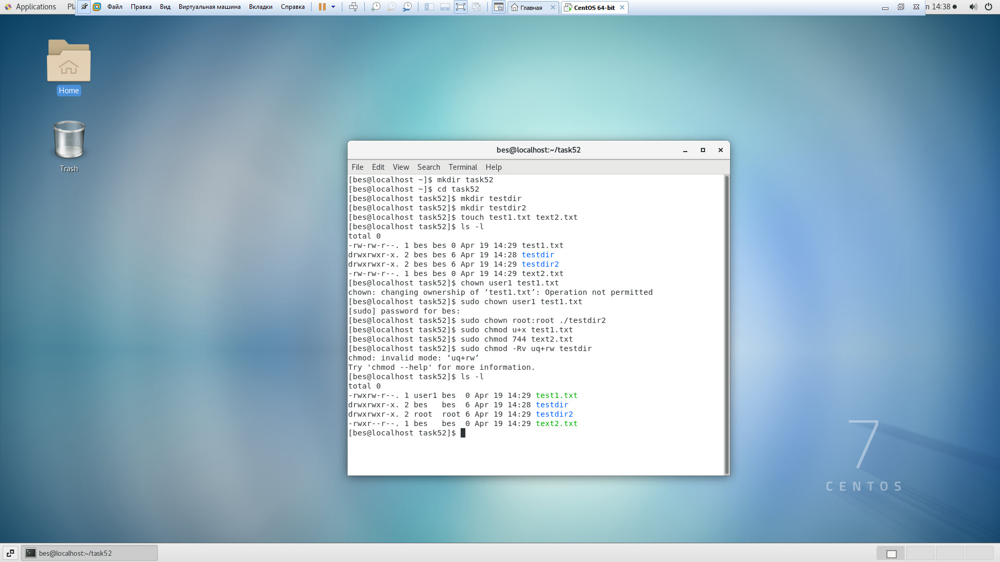

15) What is an example of octal representation of access rights? Describe the
umask command.

It is easy to think of the permission settings as a series of bits (which is how the computer thinks about them).
Here's how it works:

`rwx rwx rwx = 111 111 111`
`rw- rw- rw- = 110 110 110`
`rwx --- --- = 111 000 000`

and so on...

`rwx = 111 in binary = 7`
`rw- = 110 in binary = 6`
`r-x = 101 in binary = 5`
`r-- = 100 in binary = 4`

**File permissions**

| Value | Meaning |
|:-----:|:-------:|
| 777 	|    (rwxrwxrwx) No restrictions on permissions. Anybody may do anything. Generally not a desirable setting. |
| 755 	|    (rwxr-xr-x) The file's owner may read, write, and execute the file. All others may read and execute the file. This setting is common for programs that are used by all users. |
| 700 	|    (rwx------) The file's owner may read, write, and execute the file. Nobody else has any rights. This setting is useful for programs that only the owner may use and must be kept private from others. |
| 666 	|    (rw-rw-rw-) All users may read and write the file. |
| 644 	|   (rw-r--r--) The owner may read and write a file, while all others may only read the file. A common setting for data files that everybody may read, but only the owner may change. |
| 600 	|    (rw-------) The owner may read and write a file. All others have no rights. A common setting for data files that the owner wants to keep private. |

**Directory permissions**

| Value | Meaning|
|:-----:|:-------:|
| 777 	|(rwxrwxrwx) No restrictions on permissions. Anybody may list files, create new files in the directory and delete files in the directory. Generally not a good setting. |
| 755 	|(rwxr-xr-x) The directory owner has full access. All others may list the directory, but cannot create files nor delete them. This setting is common for directories that you wish to share with other users. |
| 700 	|(rwx------) The directory owner has full access. Nobody else has any rights. This setting is useful for directories that only the owner may use and must be kept private from others. |

On Linux and other Unix-like operating systems, new files are created with a
default set of permissions. Specifically, a new file's permissions may be
restricted in a specific way by applying a permissions "mask" called the umask.
The umask command is used to set this mask, or to show you its current value.

`umask [-S] [mask]`

-S 	    Accept a symbolic representation of a mask, or return one.
mask 	If a valid mask is specified, the umask is set to this value.
        If no mask is specified, the current umask value is returned.
		
So, for example, the following umask command:

`umask u+w`

sets the mask so that when files are created, they have permissions which allow write permission for the user (file owner).
The rest of the file's permissions would be unchanged from the operating system default.

Multiple changes can be specified by separating multiple sets of symbolic notation with commas (but not spaces!).
For example:

`umask u-x,g=r,o+w`
This command sets the mask so that when subsequent files are created, they have permissions that:

*prohibit the execute permission from being set for the file's owner (user), while leaving the rest of the owner permissions unchanged;
*enable read permission for the group, while prohibiting write and execute permission for the group;
*enable write permission for others, while leaving the rest of the other permissions unchanged.

Note that if you use the equals operator ("="), any permissions not specified will be specifically prohibited.
For example, the command

`umask a=`

Sets the file creation mask so that new files are inaccessible to everyone.

The umask masks permissions by restricting them by a certain value.

Essentially, each digit of the umask is "subtracted" from the OS's default value to arrive at the default value
you define. It's not really subtraction; technically, the mask is negated (its bitwise compliment is taken) and
this value is then applied to the default permissions using a logical AND operation. The result is that the umask
tells the operating system which permission bits to "turn off" when it creates a file.

In Linux, the default permissions value is 666 for a regular file, and 777 for a directory. When creating a new file
or directory, the kernel takes this default value, "subtracts" the umask value, and gives the new files the resulting
permissions.

This table shows how each digit of the umask value affects new file and directory permissions:

| umask  digit | 	default file permissions |	default directory permissions |
|:------------:|:---------------------------:|:------------------------------:|
| 0 	       |rw 	                         | rwx |
| 1 	       |rw 	                         | rw  |
| 2 	       |r 	                         | rx  |
| 3 	       |r 	                         | r   |
| 4 	       |w 	                         | wx  |
| 5 	       |w 	                         | w   |
| 6 	       |x 	                         | x   |
| 7 	       |(no permission allowed)      |	(no permission allowed) |

So if our umask value is 022, then any new files will, by default, have the permissions 644 (666 - 022).
Likewise, any new directories will, by default, be created with the permissions 755 (777 - 022).

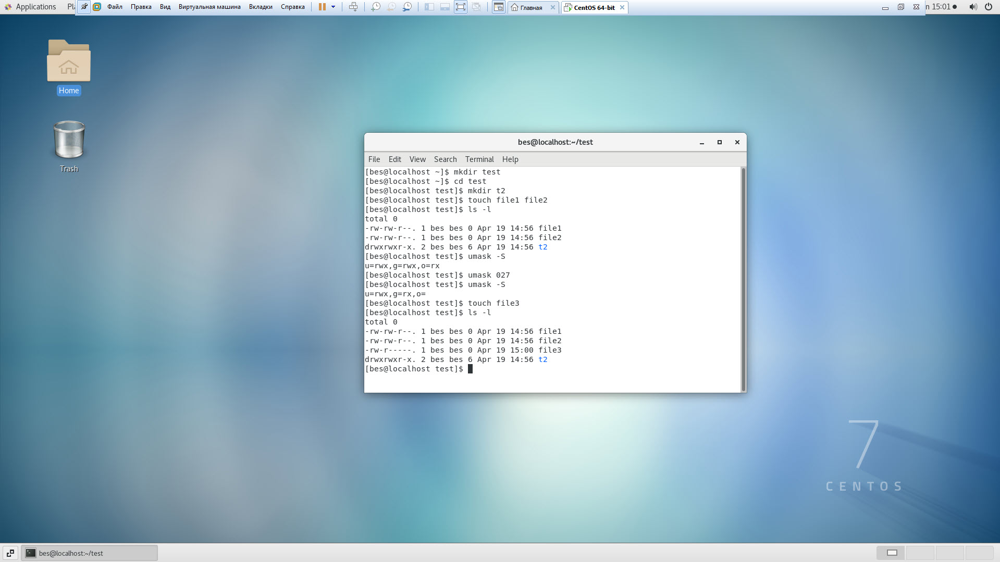

16) Give definitions of sticky bits and mechanism of identifier substitution. Give
an example of files and directories with these attributes.

Sticky Bit is mainly used on folders in order to avoid deletion of a folder and it’s content by other users though
they having write permissions on the folder contents. If Sticky bit is enabled on a folder, the folder contents are
deleted by only owner who created them and the root user. No one else can delete other users data in this
folder(Where sticky bit is set). This is a security measure to avoid deletion of critical folders and their
content(sub-folders and files), though other users have full permissions.

If you set the sticky bit to a directory, other users cannot delete or rename the files (or subdirectories)
within that directory.

When the sticky bit is set on a directory, only the owner and the root user can delete / rename the files
or directories within that directory.

`chmod 1777 dir`
or
`chmod +t dir`

`mkdir allAccess`

`chmod 777 allAccess`

`ls -ld allAccess`

So we see that a directory named ‘allAccess’ is created and read-write-execute access to this directory is
given to all the users through chmod command.

Now, create multiple files in this directory (with different users) such that all users have read-write-execute
access to them.

For example:

`ls -l allAccess`

The files file1 and file2 are created by different users but have read-write-execute
access on for all the users. This means that the user ‘user1’ can delete or rename the file
created by user ‘user2’.

In order to avoid this, sticky bit can be set on the directory allAccess.

Now, turn ON the sticky bit on the directory by using +t flag of chmod command.

`chmod +t allAccess`

`ls -ld allAccess`

As can be observed, a permission bit ‘t’ is introduced in the permission bits of the directory.

Now, if the user 'user1' tries to rename the file 'file2', here is what happens :

`mv /home/bes/allAccess/file1 /home/bes/allAccess/file2`
`mv: try to overwrite 'file2', overriding mode 0664 (rw-rw-r--)?

So we see that the operation was not permitted.
Remove sticky bit using -t option

Sticky bit can be removed from a directory permissions through the -t option of the chmod command.

Here is an example :

`chmod -t allAccess`

`ls -ld allAccess`
drwxrwxrwx 2 himanshu himanshu 4096 Oct 24 16:19 allAccess/

So we see that the permission bit ‘t’ is removed from directory.

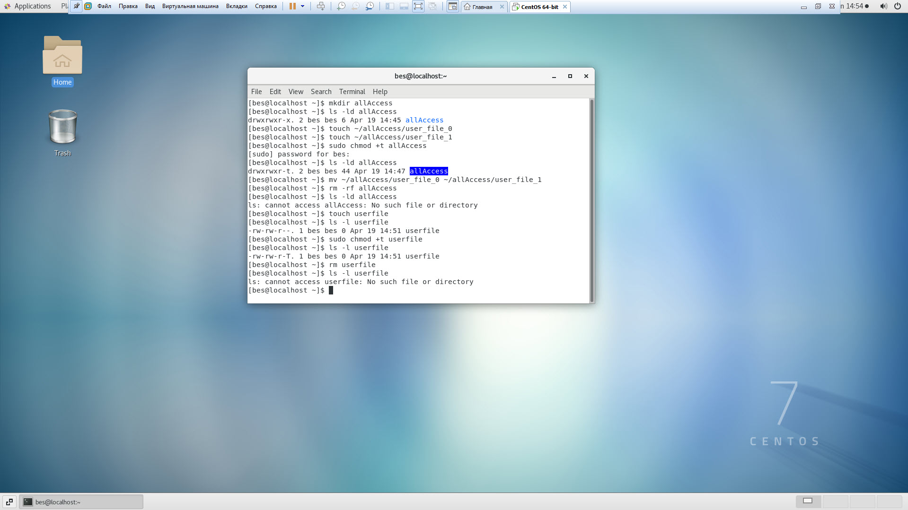

17) What file attributes should be present in the command script?

File must have permission for execution for user, group and owner

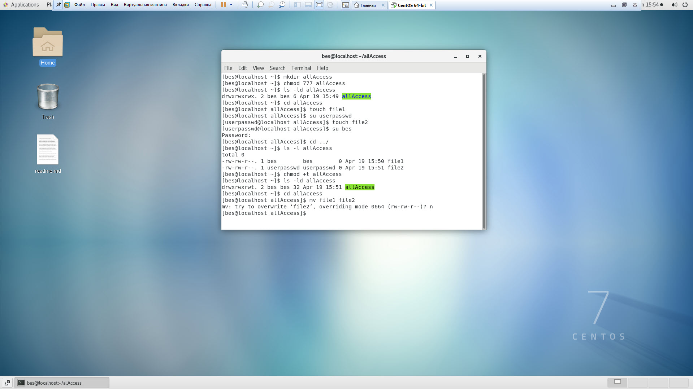