# EPAM University Programs
# DevOps external course
# Module 5 05 Linux Essential
# TASK 5.3

## Part1

1. How many states could has a process in Linux?

Linux has basically 5 states:

* Running/Runnable (R): running processes are processes using a CPU core right now, a runnable process is a process that has everything to run and is just waiting for a CPU core slot.

* Sleeping: a sleeping process is a process waiting for a resource to be available (for example, a I/O operation to complete) or an event to happen (like a certain amount of time to pass). The difference between process in Interruptible Sleep (S) state and Uninterruptible Sleep (D) is that the former will wake up to handle signals while the former won't. We'll talk about signals in a moment, but let's suppose that a process is waiting for a I/O operation to complete before wake up. If in the meantime, it receives a signal to terminate (SIGKILL), it will terminate before having the chance to handle the requested data. That's why I/O operations normally go to uninterruptible sleep while waiting for the result: they will wake up with when the operation is ready, handle the result and, only then, check for any pending signal to handle. Processes that can be terminated before the wake up condition is fulfilled without any consequence usually go to interruptible sleep instead.

* Stopped (T): a process becomes stopped when it receives the SIGSTOP signal (not unlike when you press <ctrl>+z in the shell, although <ctrl>+z sends a SIGTSTP instead). When stopped, the process execution is suspended and the only signals it will handle are SIGKILL and SIGCONT. The former will remove the process permanently, while the later will put the process back to the Running/Runnable state (like when you run fg or bg after pressing <ctrl>+z in the shell).

* Zombie (Z): when a process finishes with exit() system call, its state needs to be "reaped" by its parent (calling wait()); in the meantime, the child process remains in zombie state (not alive nor dead).

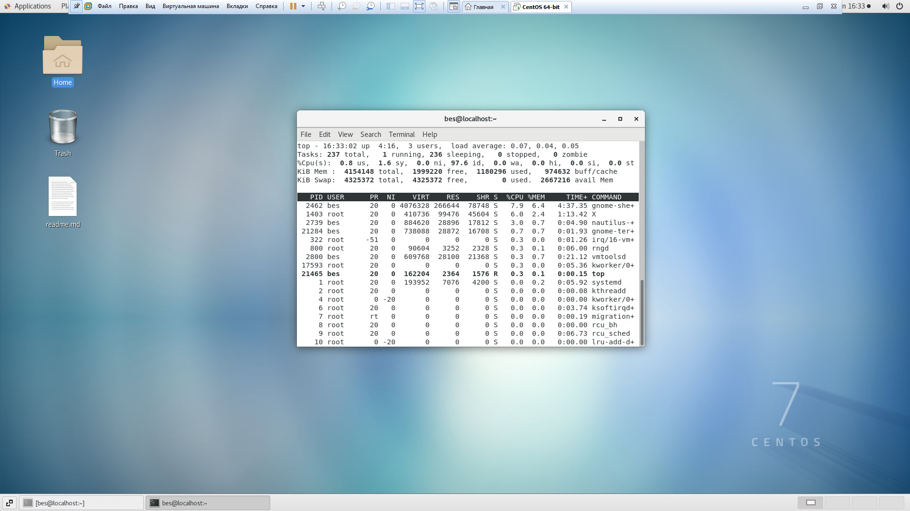

2. Examine the pstree command. Make output (highlight) the chain (ancestors) of the current
process.

`pstree -hp`

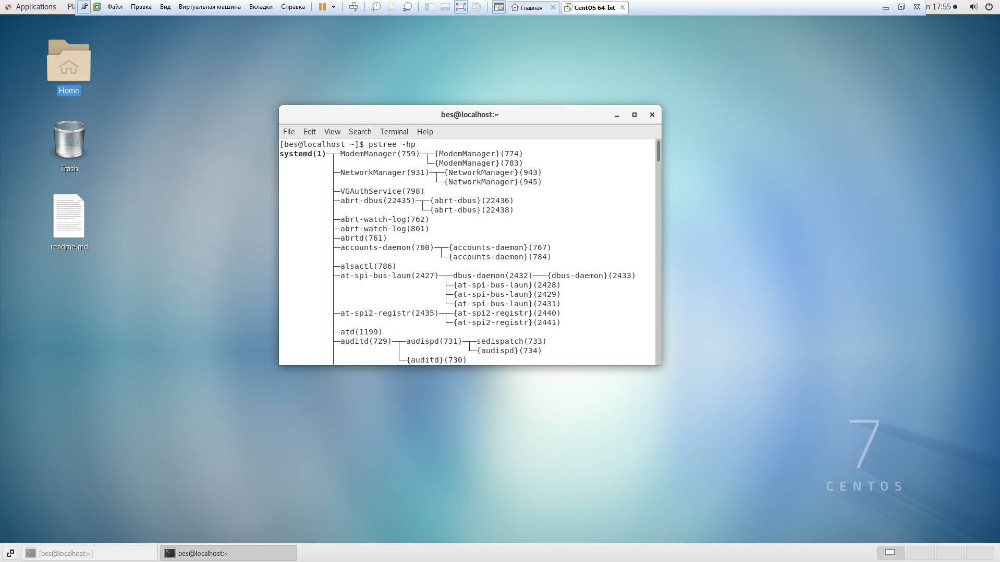

3. What is a proc file system?

Proc file system (procfs) is virtual file system created on fly when system boots
and is dissolved at time of system shut down. It contains the useful information
about the processes that are currently running, it is regarded as control and information
centre for kernel.

`ls -l /proc`

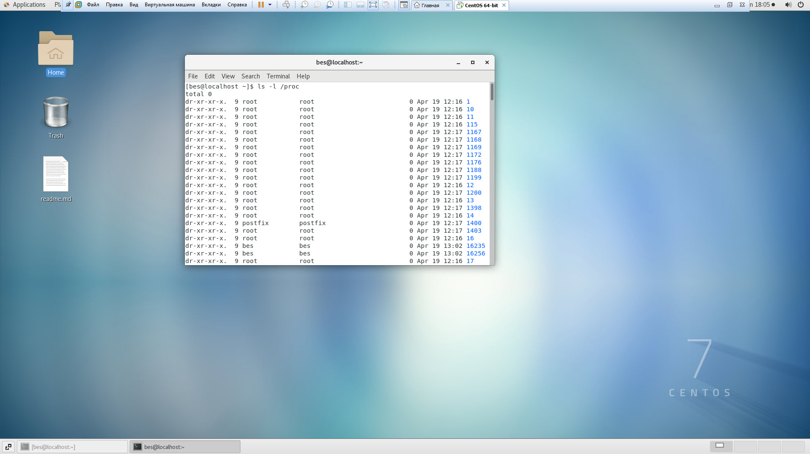

4. Print information about the processor (its type, supported technologies, etc.).

`mpstat 2 10`

or

`lscpu`

or

`lshw | grep cpu`

or 

`less /proc/cpuinfo`

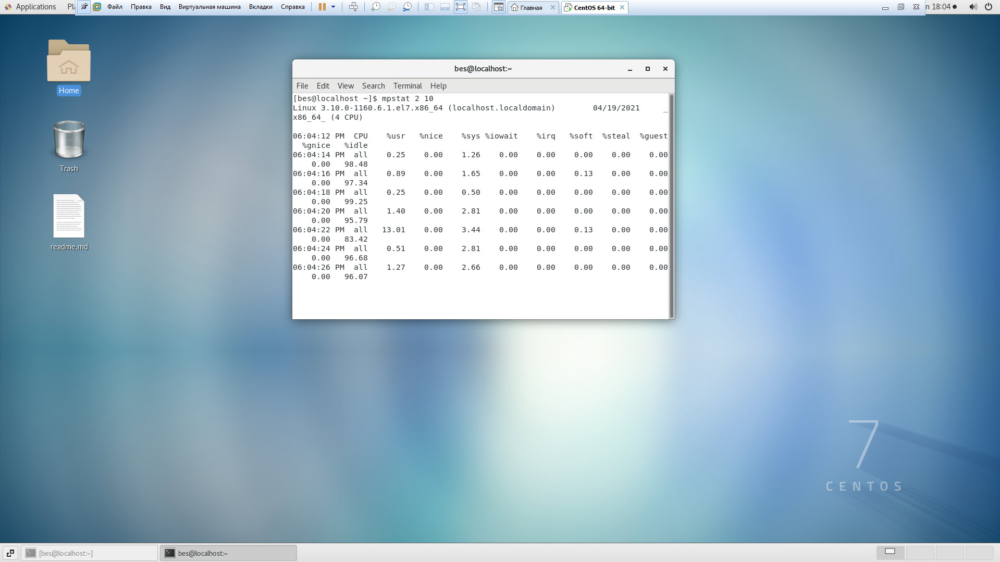

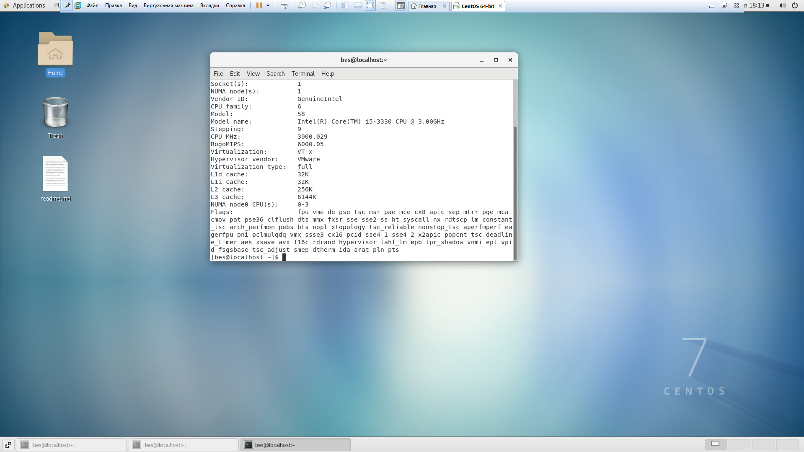

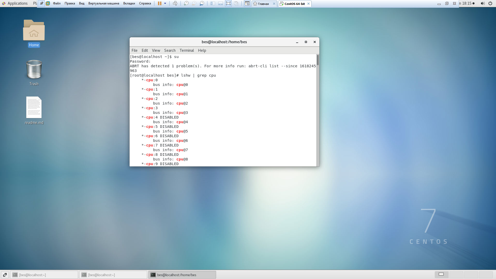

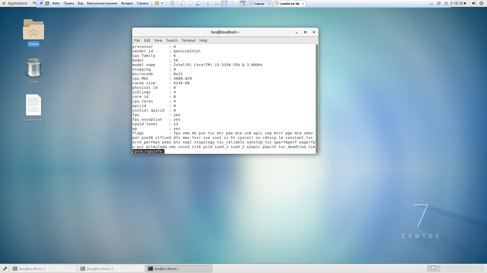

5. Use the ps command to get information about the process. The information should be as
follows: the owner of the process, the arguments with which the process was launched for
execution, the group owner of this process, etc.

`ps` - report a snapshot of the current processes.

`ps -eF`

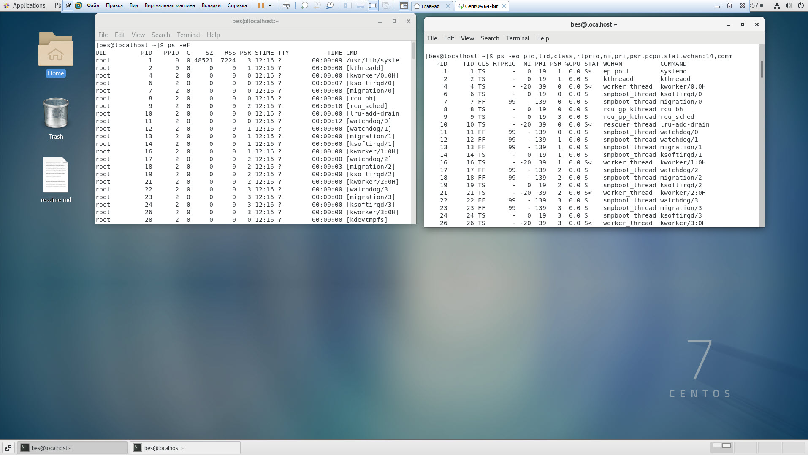

6. How to define kernel processes and user processes?

User-space processes have its own virtual address space.
Kernel processes or threads do not have their own address space,
they operate within kernel address space only. And they may be
started before the kernel has started any user process (e.g. init).

One way to recognize kernel processes is that they don't use any user memory,
so the vsz field is 0. This also catches zombies , which can be eliminated based on their status.

`ps axl | awk '$7 != 0 && $10 !~ "Z"'`

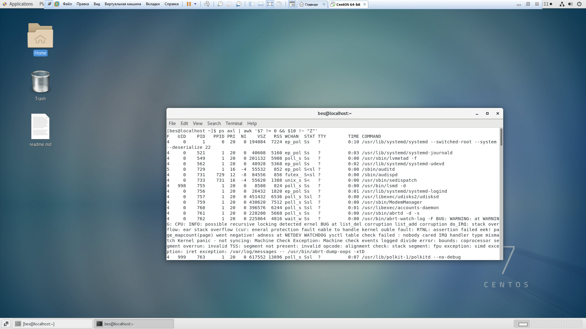

7. Print the list of processes to the terminal. Briefly describe the statuses of the processes.
What condition are they in, or can they be arriving in?

The process is:

* program in progress

* "object" to which CPU time is allocated

* asynchronous work

Several models are used to describe the states of processes.
The simplest model is the three-state model. The model consists of:

*  execution states
	
*  waiting states
	
*  ready states

Execution is an active state during which a process has all the resources it needs.
In this state, the process is directly executed by the processor.

Waiting is a passive state during which the process is blocked, it cannot be executed,
because it is waiting for some event, for example, data entry or release of the device it needs.

Ready is a passive state, the process is blocked, but unlike the waiting state,
it is blocked not for internal reasons, but for external reasons, independent of the process.

From the ready state, the process can only go to the running state. 

The process with PID 1 is the leader of the session and is in a waiting state. 

The process with PID 58  is currently running .

The process with PID 10  is in a waiting state with high priority.

The process with PID 46  is in a waiting state with low priority.

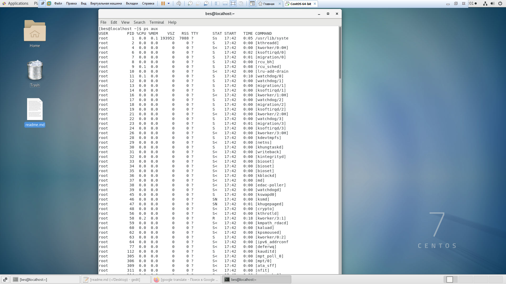

8. Display only the processes of a specific user.

`p -x`

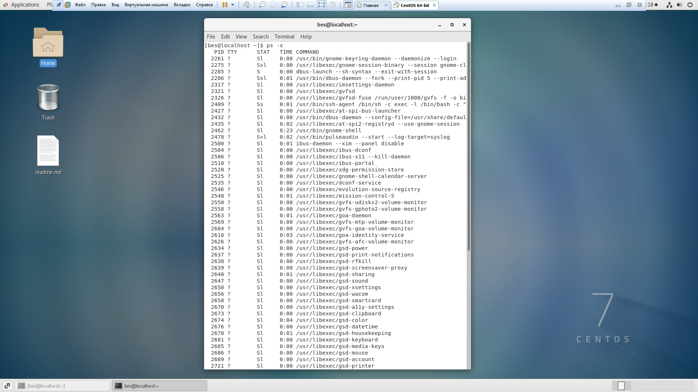

9. What utilities can be used to analyze existing running tasks (by analyzing the help for the ps
command)?

awk, find, cut, grep and other utilities can be used to analyze existing running tasks

`ps axl | awk '$7 != 0 && $10 !~ "Z"'`

That is check for processes whose `/proc/<pid>/exe` is a link to a file:

`ps -p "$(find -L /proc/[0-9]*/exe ! -type l | cut -d / -f3 | paste -sd , -)"`

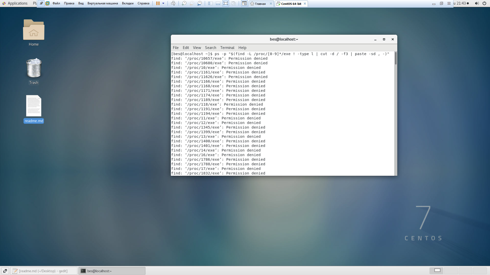

10. What information does top command display?

top command is used to show the Linux processes. It provides a dynamic real-time
view of the running system. Usually, this command shows the summary information of
the system and the list of processes or threads which are currently managed by the Linux Kernel.

11. Display the processes of the specific user using the top command.
    
`top -u bes` 

or press `u` interactively to shows processes for a particular user.
You are prompted to enter the username. Blank will show for all users.
It displays only processes with a user id or user name matching that given,
matches on effective user

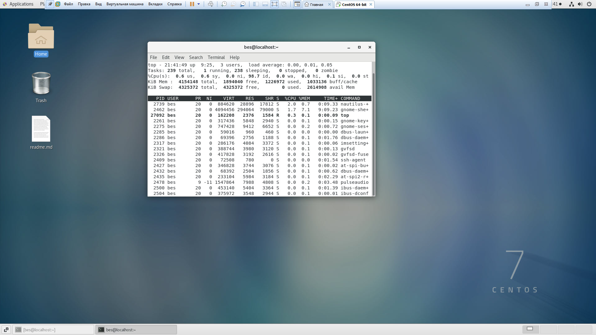

12. What interactive commands can be used to control the top command? Give a couple of
examples.

First of all, you can press h or ? to display the help menu for interactive commands
or a condensed list of commands. We can see the roles of the differents key that
we can use in top command execution.

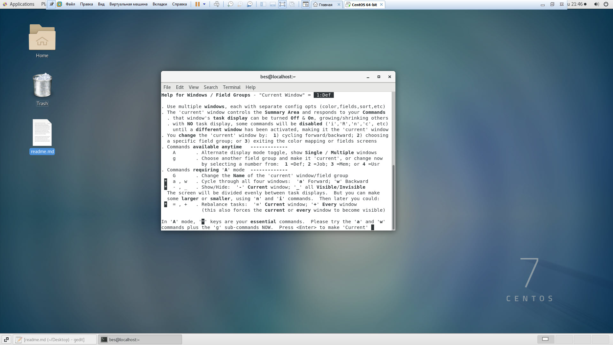

You can switch between 4 windows with `a` and `w` keys. a moves to next and `w` to previous window.
With `g` command, you can enter a number to select the current window.

Some important information is shown in bold characters. B command toggles use of bold.
This command will influence the use of the bold terminfo capability and alters both
the summary area and task area for the current window. When this toggle is 'ON' and
top is operating in monochrome mode, the entire display will appear as normal text.
Thus, unless the x and/or y toggles are using reverse for emphasis, there will be no
visual confirmation that they are even on.

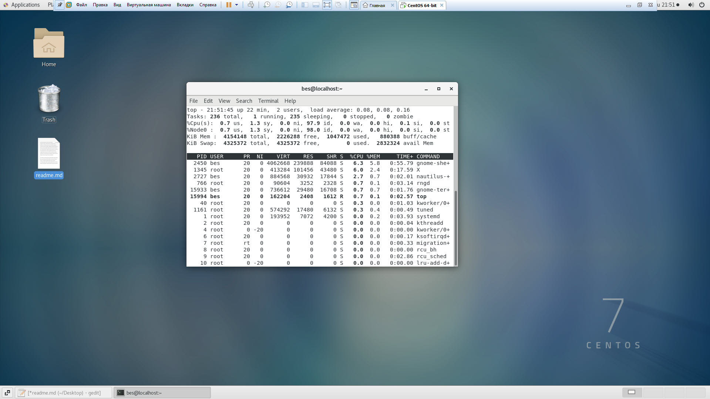

`d` or `s` keys change the delay between refreshes. Prompt for new delay time, which should be in seconds.
Suppressed in secure mode. When `d` or `s` is pressed, you will be prompted to enter a value ( in seconds )
which will be set as display interval. If you enter 1 here, top will refresh every second.

`l`, `t` and `m` keys will toggle load average, task/cpu status and mem info respectively as discussed in Uptime
and Load Average, CPU State and Memory Usage.

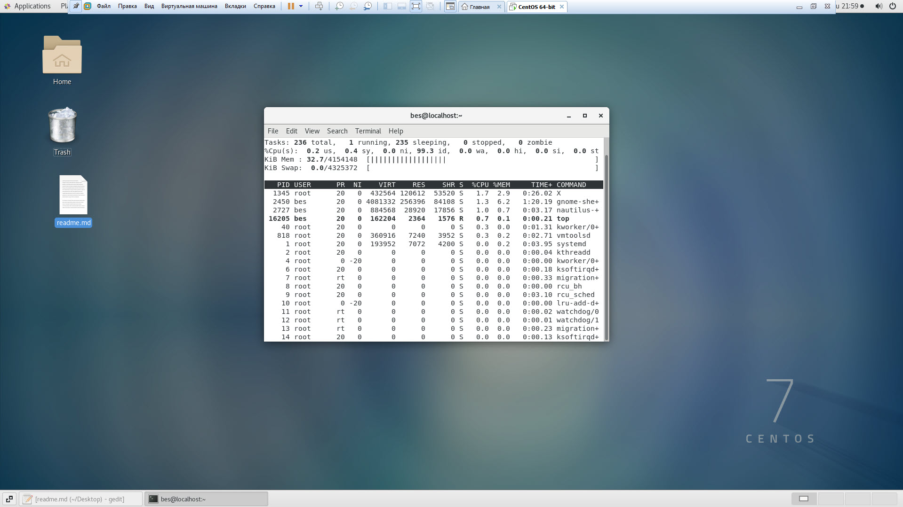

`F` key used to choose what field you want to display on the output screen. To select a field to display,
press `SPACE` or `d` key on the name. The fields marked as * are selected.
Press q or ESC to quit when you have finished.

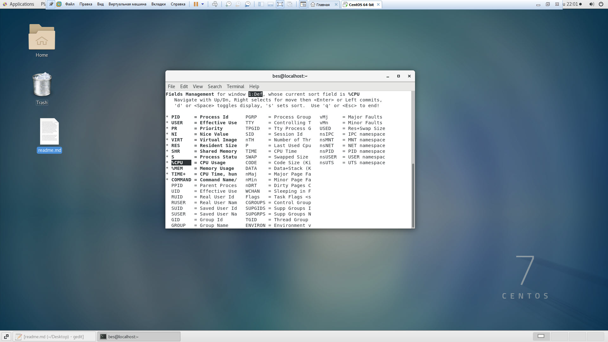

By default, the sorting is done in descending order. Pressing R shall reverse the sorting order
of the currently sorted column, using this interactive command displays pProcesses consuming the
least amount of cpu are shown first.

`c` displays the full command path along with the command line arguments in the `COMMAND` column.

`i` key does not show idle tasks Toggle idle tasks. It displays all tasks or just active tasks.
When this toggle is Off, tasks that have not used any CPU since the last update will not be
displayed. However, due to the granularity of the %CPU and TIME+  fields,  some process may
still be displayed that appear to have used no CPU.

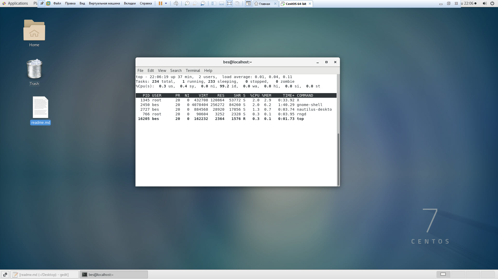

`V` key will display the processes in a parent-child hierarchy as below

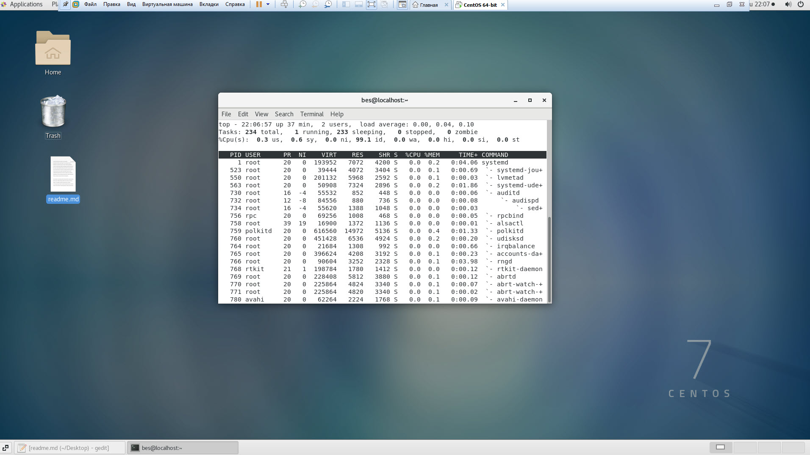

Pressing the `Z` key takes the user to a screen where the display color can be changed for
top command. You will be presented with a separate screen. That screen can be used to change
the colors in just the current window or in all four windows before returning to the top display.
When you issue the `Z` interactive command, you have 4 upper case letters to select a target
for 8 numbers to select a color

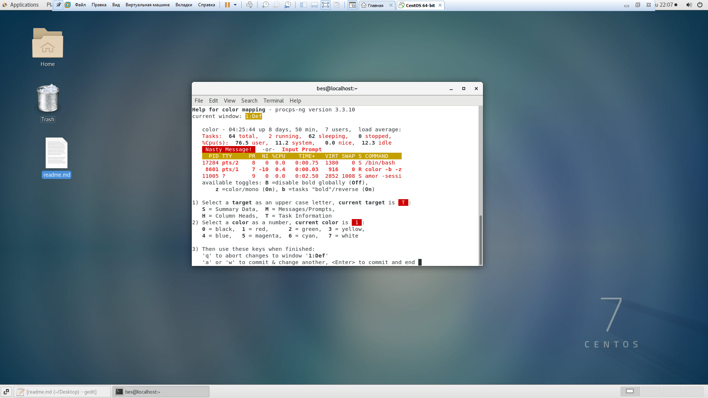

`z` turns on or off the colored display. it switches the current window between your last
used color scheme and the older form of black-on-white or white-on- black.
This command will alter both the summary area and task area

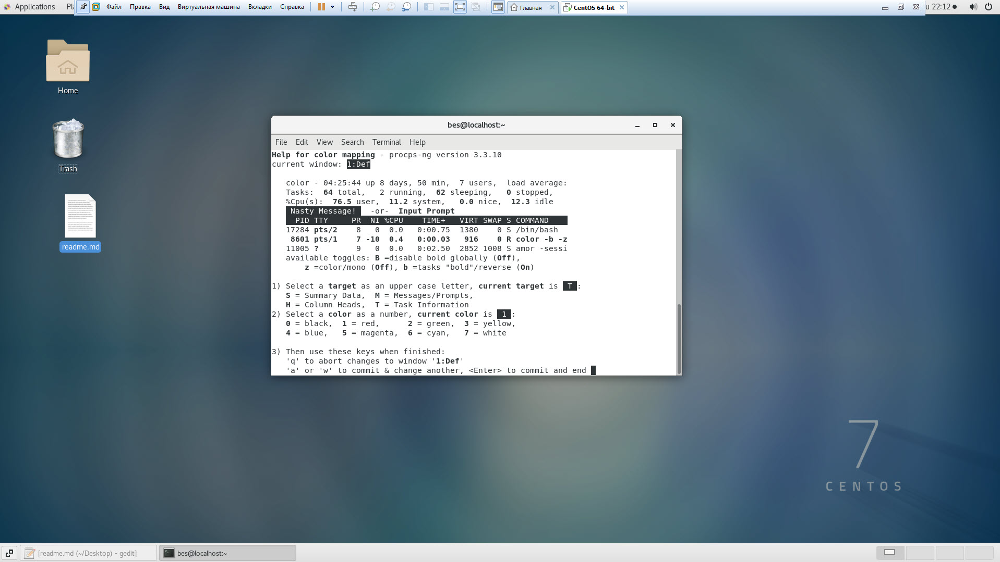

n or # set the maximum number of tasks displayed. It prompts to enter the number of tasks
to display.
The lessor of your number and available screen rows will be used. When used in alternate-display
mode, this is the command that gives you precise control over the size of each currently visible
task display, except for the very last. It will not affect the last window's size, as all prior
task displays will have already been painted.

Shows Absolute Path of Processes: Press ‘c‘ option in running top command, it will display absolute
path of running processes.

One of the most important commands of top. k is used to send signals to tasks (Usually kill tasks).
You will be prompted for a PID and then the signal to send. Entering no PID or a negative number
will be interpreted as the default shown in the prompt (the first task displayed).
A PID value of zero means the top program itself. The default signal, as reflected in the prompt,
is SIGTERM. However, you can send any signal, via number or name. If you wish to abort the kill process,
do one of the following depending on your progress: at the

*   at the pid prompt, type an invalid number
*   at the signal prompt, type 0 (or any invalid signal)
*   at any prompt, type <Esc>

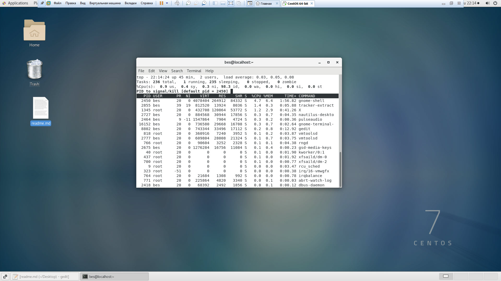

13. Sort the contents of the processes window using various parameters (for example, the
amount of processor time taken up, etc.)

By default, we have the full screen display mode where the summary and the task data are
displayed in a single window. So, at any time, only one field group can be displayed.
There is also the Alternate Display Mode, where there can be a maximum of four windows,
each displaying a field group. These windows are named Def, Job, Mem and Usr

* Def: sorted by %CPU
* Job: sorted by PID
* Mem: sorted by %MEM
* Usr: sorted by User field

The Alternate Display Mode can be entered into using the A display mode toggle command.
Each of the 4 field groups has a unique separately configurable summary area and its own
configurable task area. Only one of these 4 windows will be the current window.
The current window is displayed on the top left corner.

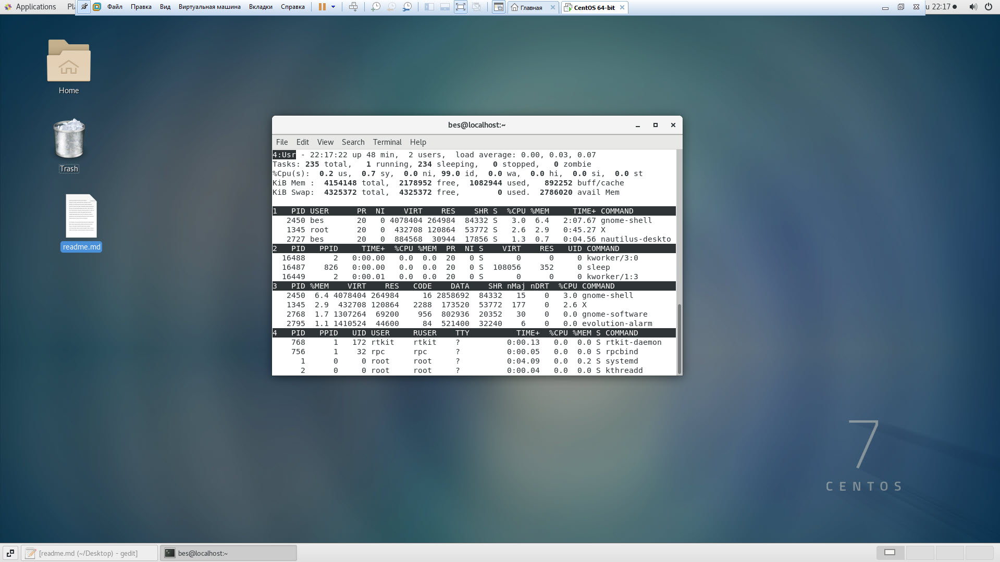

14. Concept of priority, what commands are used to set priority?

The kernel stores a great deal of information about processes including process
priority which is simply the scheduling priority attached to a process. Processes
with a higher priority will be executed before those with a lower priority, while
processes with the same priority are scheduled one after the next, repeatedly.

There are a total of 140 priorities and two distinct priority ranges implemented in Linux.
The first one is a nice value (niceness) which ranges from -20 (highest priority value) to 19
(lowest priority value) and the default is 0, this is what we will uncover in this guide.
The other is the real-time priority, which ranges from 1 to 99 by default, then 100 to 139 are meant for user-space.

One important characteristic of Linux is dynamic priority-based scheduling, which allows the nice value
of processes to be changed (increased or decreased) depending on your needs, as we’ll see later on.

For example, instead of starting a program or command with the default priority,
you can start it with a specific priority using following nice command.

`sudo nice -n 5 tar -czf backup.tar.gz ./Documents/`
or
`sudo nice --adjustment=5 tar -czf backup.tar.gz ./Documents/`

As we mentioned before, Linux allows dynamic priority-based scheduling.
Therefore, if a program is already running, you can change its priority
with the renice command in this form:

`sudo renice -n  -12  -p 6974    #renice - alter priority of running processes` 

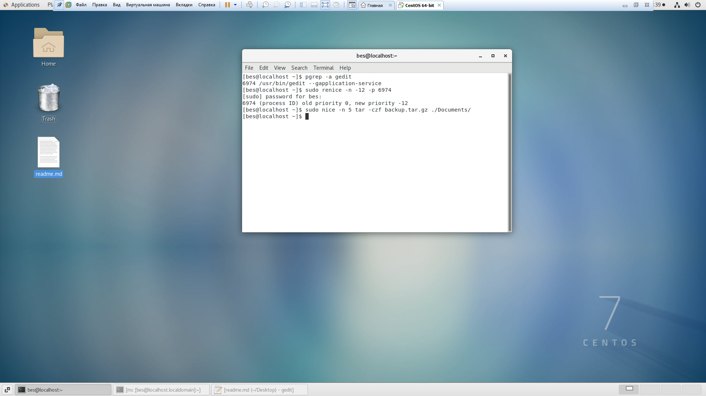

15. Can I change the priority of a process using the top command? If so, how?

The r option is used to change the priority of the process. This operation is also called
renice a task to change the scheduling priority. You will be prompted for a PID and then the
value to nice it to. Entering no PID or a negative number will be interpreted as the default
shown in the prompt (the first task displayed). A PID value of zero means the top program itself.
A positive nice value will cause a process to lose priority. Conversely, a negative nice value
will cause a process to be viewed more favorably by the kernel.

As a general rule, ordinary users can only increase the nice value and are prevented from lowering it.
If you wish to abort the renice process, do one of the following depending on your progress:

*   at the pid prompt, type an invalid number
*   at the nice prompt, type <Enter> with no input
*   at any prompt, type <Esc>

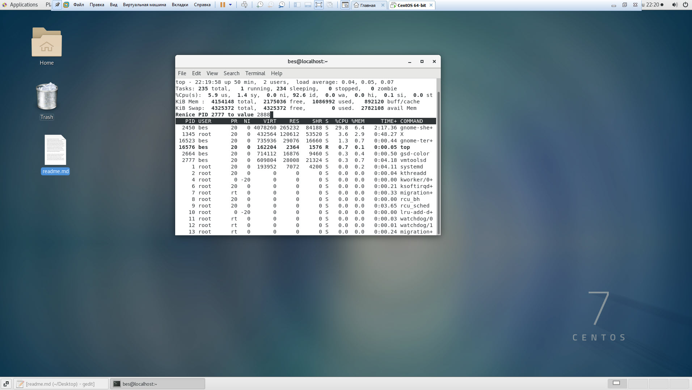

16. Examine the kill command. How to send with the kill command
process control signal? Give an example of commonly used signals.

we can use the kill command to terminate the process.

`kill <pid>`

A somewhat common (though if it happens to you a lot, than that may be sign that something is wrong)
issue is when you run kill <pid> on a process and the process does not terminate.
This can happen for many reasons but what can you do in those scenarios?
Well a common response is to use the kill command with the -9 flag.
So why does -9 work? Well when the kill command is run it is actually sending a singal to the process.
By default the kill command will send a SIGTERM signal to the specified process.
The SIGTERM signal tells the process that it should perform it's shutdown proceedures
to terminate the process cleanly by closing all log files, connections, etc. 

When a process is in a limbo state it is reasonable to send the process the SIGKILL
signal, which can be invoked by running the kill command with the -9 flag.
Unlike SIGTERM the SIGKILL signal cannot be captured by the process and thus it
cannot be ignored. The SIGKILL signal is handled outside of the process completely,
and is used to stop the process immediately. The problem with using SIGKILL is
that it does not allow an application to close its open files or database connections
cleanly and over time could cause other issues; therefor it is generally better to
reserve the SIGKILL signal as a last resort.

Each signal has a numeric Value and an Action associated to it, the numeric values can
be used with commands such as kill to define which signal is sent to the process.
Each signal also has an “action” or “disposition” associated with it which defines
what type of action this signal should invoke.
*Signal Actions*

While there are several actions for the various signals on a Linux system, I want
to highlight the below as they are the most commonly used signals from a process termination perspective.

Term - This action is used to signal that the process should terminate

Core - This action is used to signal that the process should core dump and then terminate

*Common Signals*

Below is a list of a few common signals, the numeric value of that signal, the action
that is associated with it and how to send that signal to a process. This list,
while not complete, should cover general usage of the kill command.

SIGHUP - 1 - Term

The SIGHUP signal is commonly used to tell a process to shutdown and restart,
this signal can be caught and ignored by a process.

Syntax:

`kill -1 <pid>`
`kill -HUP <pid>`
`kill -SIGHUP <pid>`

`SIGINT - 2 - Term`

The SIGINT signal is commonly used when a user presses ctrl+c on the keyboard.

Syntax:

`kill -2 <pid>`
`kill -INT`
`kill -SIGINT`

SIGQUIT - 3 - Core

The SIGQUIT signal is useful for stopping a process and telling it to create a core dump file.
The core file can be useful for debugging applications but keep in mind your system needs to be
setup to allow the creation of core files.

Syntax:

`kill -3 <pid>`
`kill -QUIT <pid>`
`kill -SIGQUIT <pid>`

SIGKILL - 9 - Term

The SIGKILL signal cannot be ignored by a process and the termination is handled outside
of the process itself. This signal is useful for when an application has stopped responding
or will not terminate after being given the SIGTERM command. This signal should stop more
processes however there are exceptions, such as zombie processes.

Syntax:

`kill -9 <pid>`
`kill -KILL <pid>`
`kill -SIGKILL <pid>`

SIGSEGV - 11 - Core

The SIGSEGV signal is generally sent to a process by the kernel when the process is misbehaving,
it is used when there is an “Invalid memory reference” and you may commonly see a message such
as segmentation fault in log files or via strace. You can also technically call this signal with
kill as well; however it is mainly useful for creating core dump files, which can also be performed
by using the SIGQUIT signal.

Syntax:

`kill -11 <pid>`
`kill -SEGV <pid>`
`kill -SIGSEGV <pid>`

SIGTERM - 15 - Term

The SIGTERM signal is the default signal sent when invoking the kill command.
This tells the process to shutdown and is generally accepted as the signal
to use when shutting down cleanly. Technically this signal can be ignored,
however that is considered a bad practice and is generally avoided.

Syntax:

`kill <pid>`
`kill -15 <pid>`
`kill -TERM <pid>`
`kill -SIGTERM <pid>`

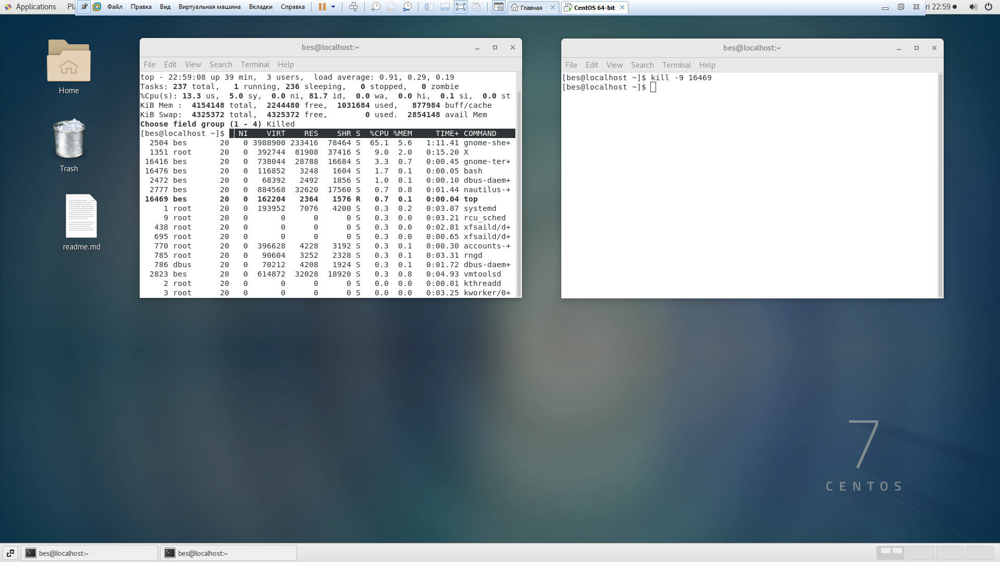

17. Commands jobs, fg, bg, nohup. What are they for? Use the sleep, yes command to
demonstrate the process control mechanism with fg, bg.

The jobs command displays the status of jobs started in the current terminal window.
Jobs are numbered starting from 1 for each session. The job ID numbers are used by
some programs instead of PIDs (for example, by fg and bg commands)

`fg` command in linux used to put a background job in foreground.

Syntax:

`fg [job_spec ...]`

`bg` command in linux is used to place foreground jobs in background.

Syntax:

`bg [job_spec ...]`

job_spec may be:

`%n` : Refer to job number n.
`%str` : Refer to a job which was started by a command beginning with str.
`%?str` : Refer to a job which was started by a command containing str.
`%%` or `%+` : Refer to the current job. fg and bg will operate on this job if no job_spec is given.
`%-` : Refer to the previous job.

When using the command shell, prefixing a command with nohup prevents the command from being
aborted automatically when you log out or exit the shell.

The name nohup stands for "no hangup." The hangup (HUP) signal, which is normally sent
to a process to inform it the user has logged off (or "hung up"), is intercepted by nohup,
allowing the process to continue running.

Syntax:

`nohup command [command-argument ...]`
`nohup --help | --version`

`yes` - output a string repeatedly until killed

Syntax:

`yes [string]`

`yes --help | --version`

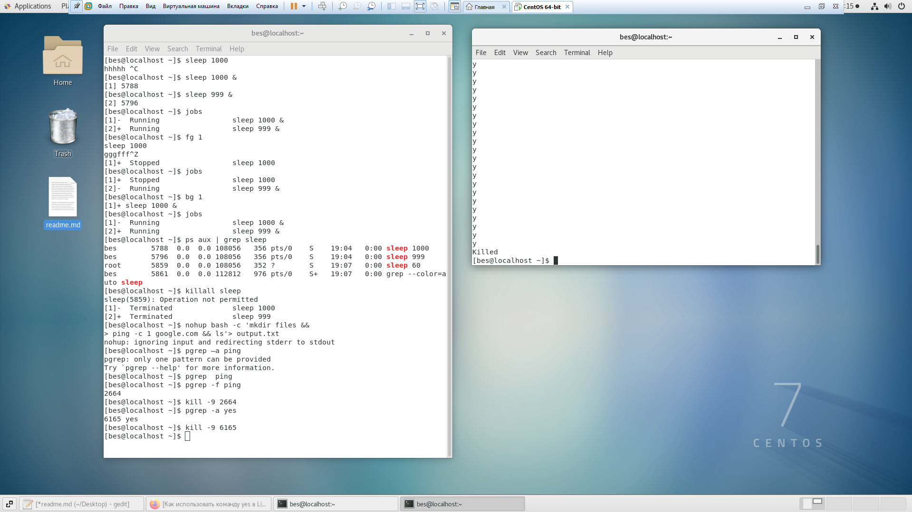

## Part2
1. Check the implementability of the most frequently used OPENSSH commands in the MS
Windows operating system. (Description of the expected result of the commands +
screenshots: command – result should be presented)

OpenSSH includes tools to help support this, specifically:

*   ssh-keygen for generating secure keys
*   ssh-agent and ssh-add for securely storing private keys
*   scp and sftp to securely copy public key files during initial use of a server

There is no need to set the key size as all Ed25519 keys are 256 bits.
In addition, they rely on a new key format that "uses a bcrypt-based key derivation
feature that makes brute-force attacks against stolen private keys much slower."
For this reason, compatibility with older versions of OpenSSH or other SSH clients
and servers can be problematic. 

The `ssh-agent` is a helper program that keeps track of user's identity keys and their
passphrases. The agent can then use the keys to log into other servers without having
the user type in a password or passphrase again. This implements a form of single sign-on (SSO).

The `ssh-add` is a command for adding SSH private keys into the SSH authentication agent
for implementing single sign-on with SSH.

The `scp` is a command for copy public key on server.

`ssh-keygen -t ed25519`

`ssh-agent`

`scp C:\Users\admin/.ssh/id_ed25519.pub vieskov@192.168.0.101`

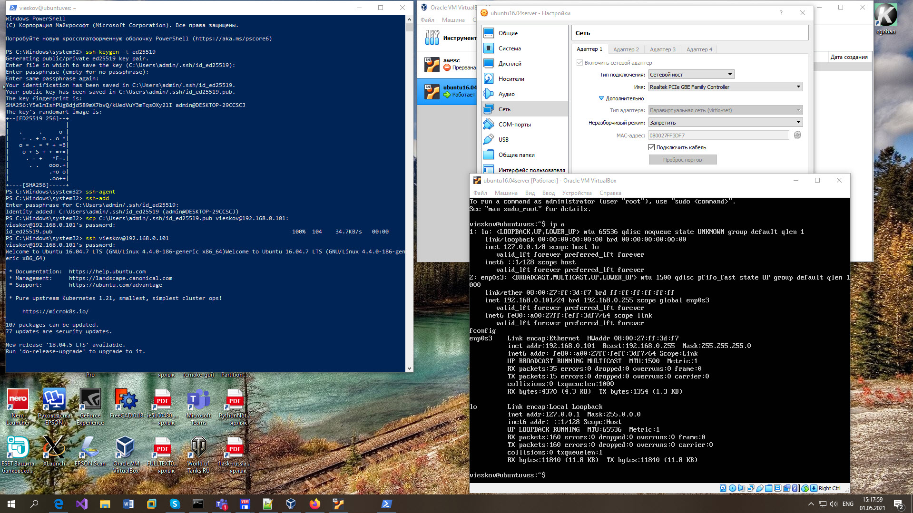

2. Implement basic SSH settings to increase the security of the client-server connection

The `~ / .ssh` directory is created on the remote server if it doesn't already exist,
and  public key is added to the authorized_keys file.

The public key is removed.

The authorized_keys file permissions set  read-only for users and disallow everything else.  

To make it impossible for users to get their permissions back, the immutable bit on the
authorized_keys file is set.

After that, users have the possibility to rename the `~/.ssh` directory and create another
directory named `~/.ssh`, with another authorized_keys file in it. To disable these
actions, set the immutable bit for the `~/.ssh` directory. 

`ssh vieskov@192.168.0.101`

`mkdir ~/.ssh`

`chmod 700 ~/.ssh`

`cat ~/id_ecdsa.pub >> ~/.ssh/authorized_keys`

`rm ~/id_ecdsa.pub`

`chmod 400 ~/.ssh/authorized_keys`

`chattr +i ~/.ssh/authorized_keys`

`chattr +i ~/.ssh`

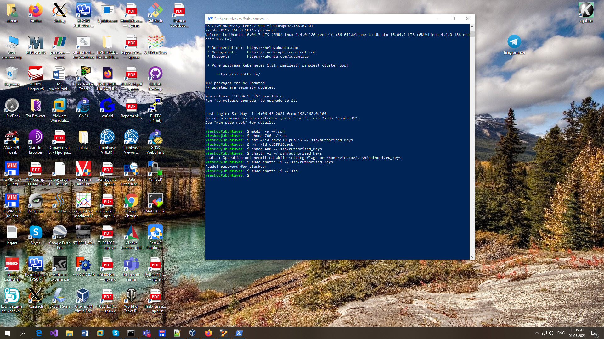

The file `sshd_config` is edited.

`nano /etc/ssh/sshd_config`

Port is changed from 22 to 2451.
Path to authorized_key is uncommented.

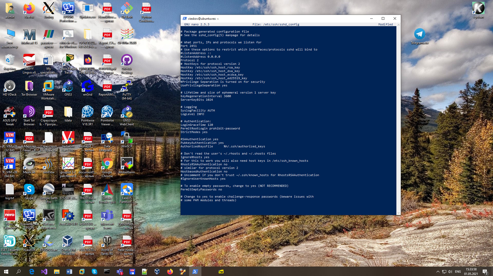

The password authentication is disabled.

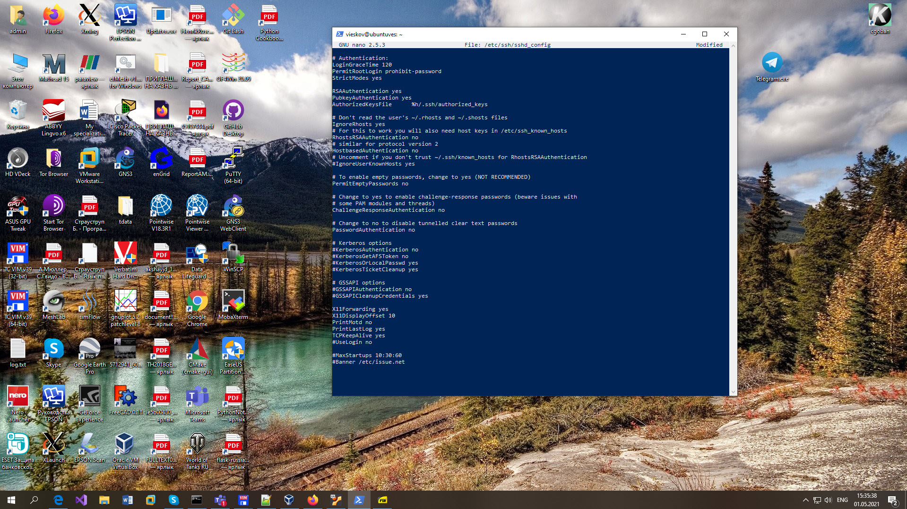

The file `sshd_config` is saved. SSh service is restarted.

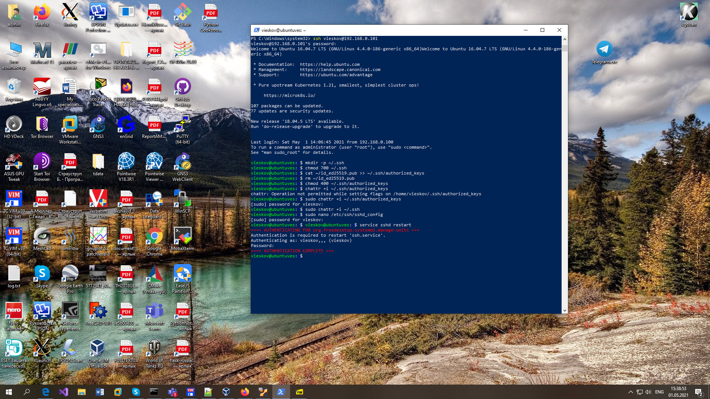

SSH connection with Windows Power Shell:

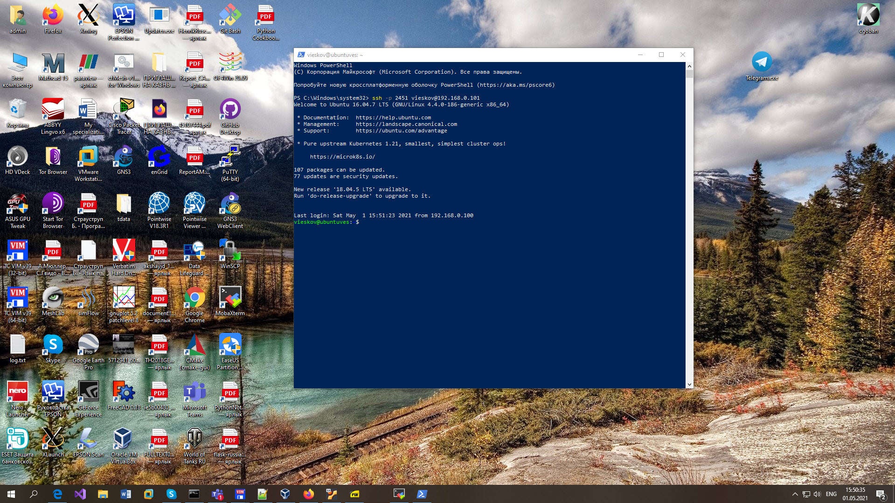

SSH connection with MobaXterm:

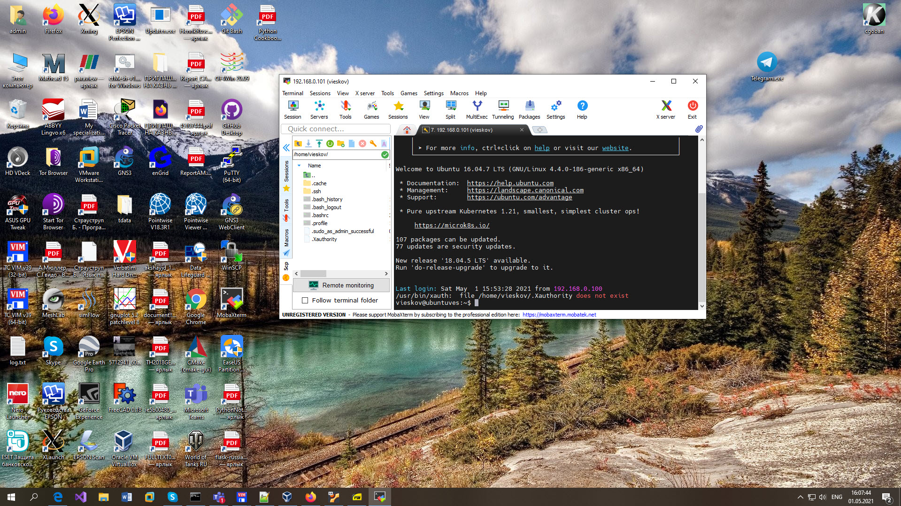

3. List the options for choosing keys for encryption in SSH. Implement 3 of them.

* DSA: It’s unsafe and even no longer supported since OpenSSH version 7, you need to upgrade it!
* RSA: It depends on key size. If it has 3072 or 4096-bit length, then you’re good. Less than that,
you probably want to upgrade it. The 1024-bit length is even considered unsafe.
* ECDSA: It depends on how well your machine can generate a random number that will be used to
create a signature. There’s also a trustworthiness concern on the NIST curves that being used by ECDSA.
* Ed25519: It’s the most recommended public-key algorithm available today!

`ssh-keygen -o -a 100 -t ed25519 -f ~/.ssh/id_ed25519 -C "evveskov@gmail.com"`

*    -o : Save the private-key using the new OpenSSH format rather than the PEM format. Actually, this option is implied when you specify the key type as ed25519.
		  
*    -a: It’s the numbers of KDF (Key Derivation Function) rounds. Higher numbers result in slower passphrase verification, increasing the resistance to brute-force password cracking should the private-key be stolen.
*    -t: Specifies the type of key to create, in our case the Ed25519.
*    -f: Specify the filename of the generated key file. If you want it to be discovered automatically by the SSH agent, it must be stored in the default `.ssh` directory within your home directory.
*    -C: An option to specify a comment. It’s purely informational and can be anything. But it’s usually filled with <login>@<hostname> who generated the key.

4. Implement port forwarding for the SSH client from the host machine to the guest Linux
virtual machine behind NAT.

Port forwarding implementation for the SSH client from the host machine to the guest Linux
virtual machine behind NAT:

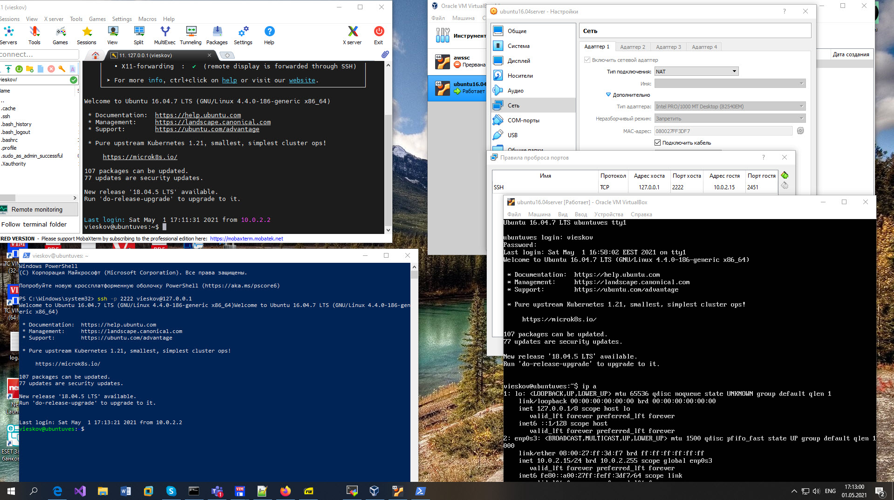

5*. Intercept (capture) traffic (tcpdump, wireshark) while authorizing the remote client on the
server using ssh, telnet, rlogin. Analyze the result.

* SSH is a recently designed, high-security protocol. It uses strong cryptography to protect
  your connection against eavesdropping, hijacking and other attacks. Telnet and Rlogin are both
  older protocols offering minimal security.

* SSH and Rlogin both allow you to log in to the server without having to type a password.
 (Rlogin's method of doing this is insecure, and can allow an attacker to access your account
 on the server. SSH's method is much more secure, and typically requires the attacker to have
 gained access to your actual client machine.)

* SSH allows you to connect to the server and automatically send a command, so that the server
 will run that command and then disconnect. So you can use it in automated processing.

Rlogin use "hand shake" messages for connection. SSH don't use it.

Wireshark and tcpdump results for SSH connection.

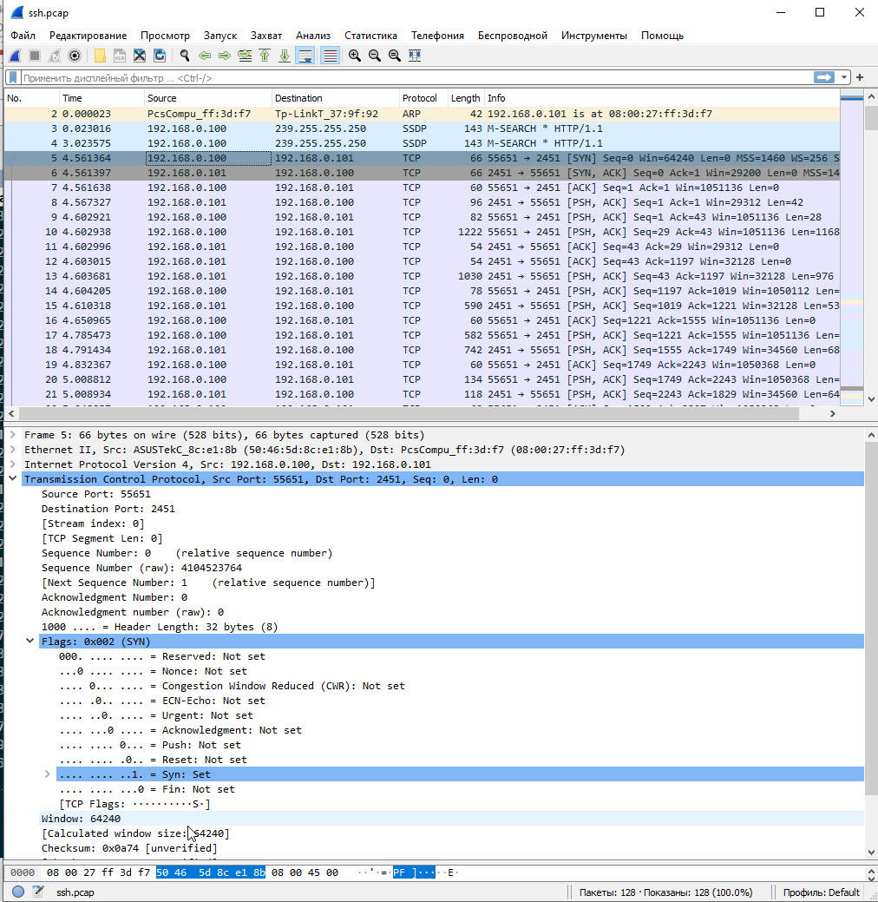

[ssh.pcap](./ssh.pcap)

Wireshark and tcpdump results for rlogin connection.

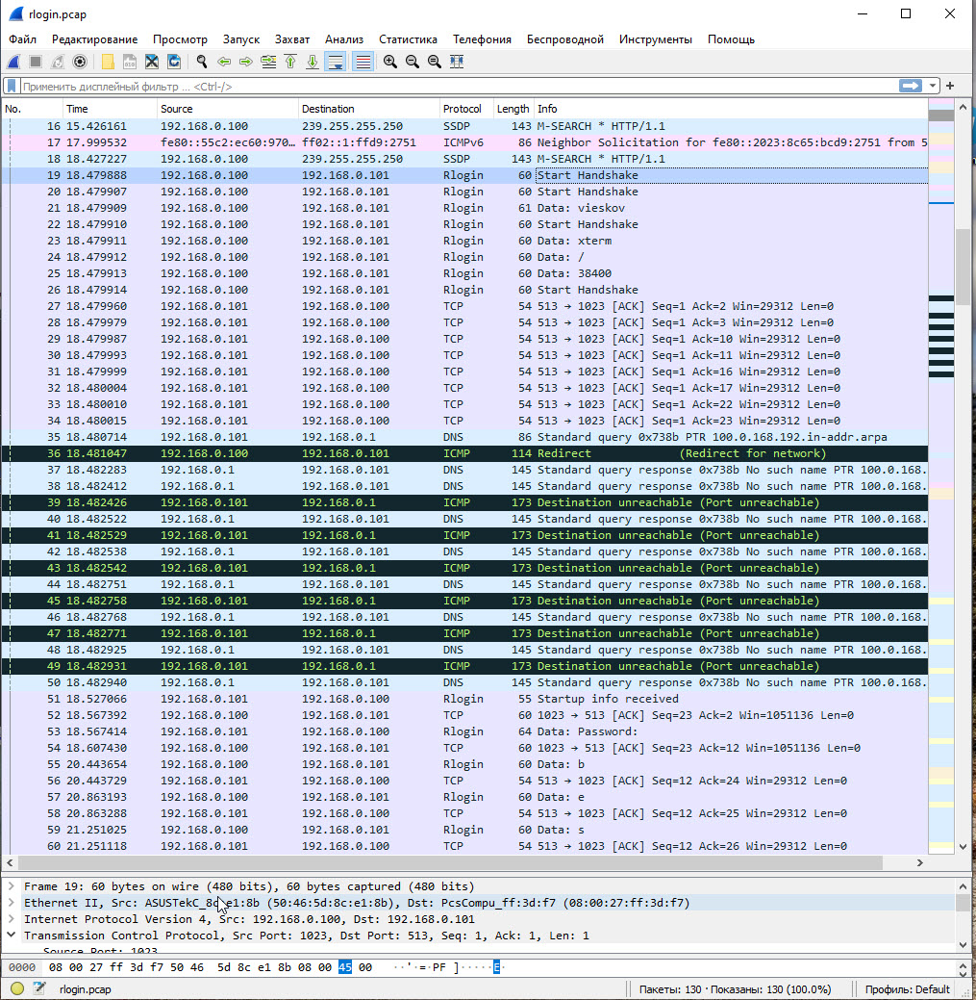

[rlogin.pcap](./rlogin.pcap)

Wireshark and tcpdump results for telnet connection.

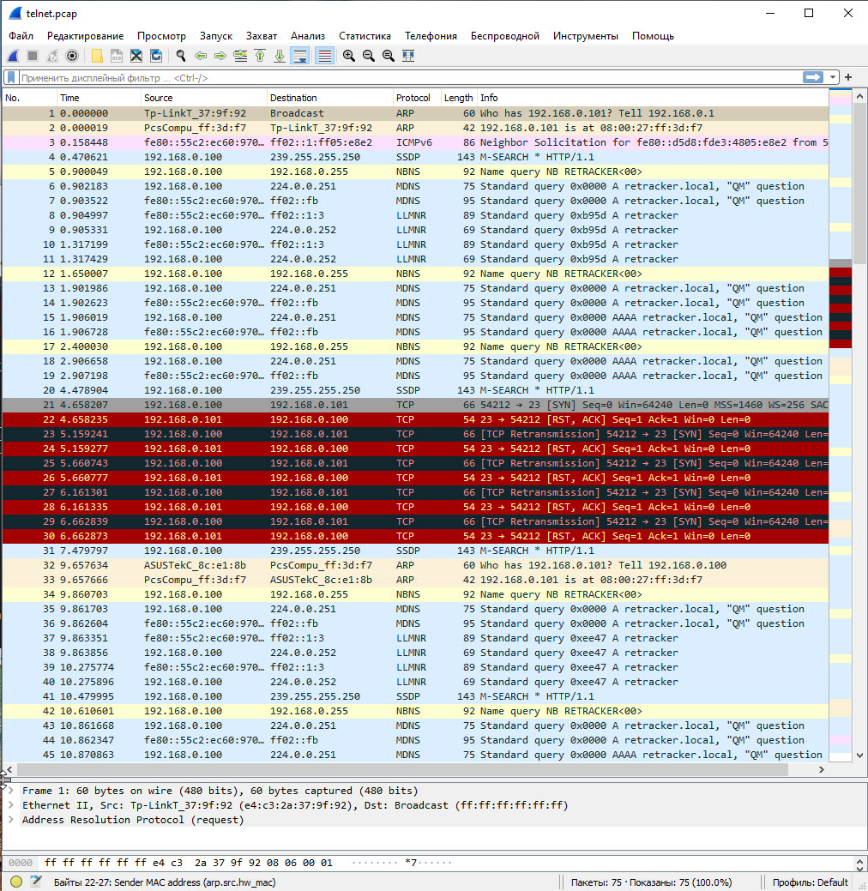

[telnet.pcap](./telnet.pcap)