# EPAM University Programs
# DevOps external course
# Module 6  Networking with Linux
# TASK 6.1

Networking with Linux
1. Create virtual machines connection according to figure 1:

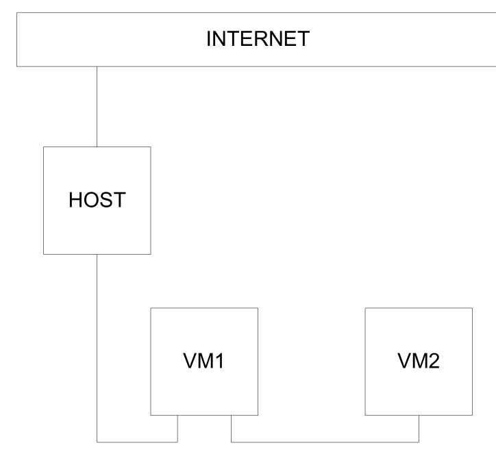

Virtual machine VM2 is cloned from VM1 from task 5.3.

2. VM2 has one interface (internal), VM1 has 2 interfaces (NAT and internal). Configure all network
interfaces in order to make VM2 has an access to the Internet (iptables, forward, masquerade).

VM1 and VM2 settings is edited.

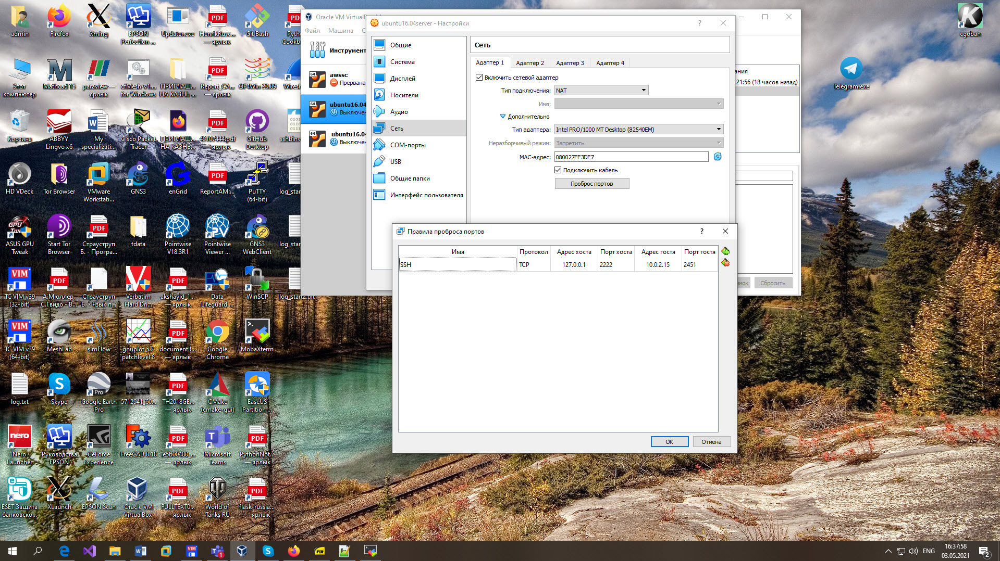

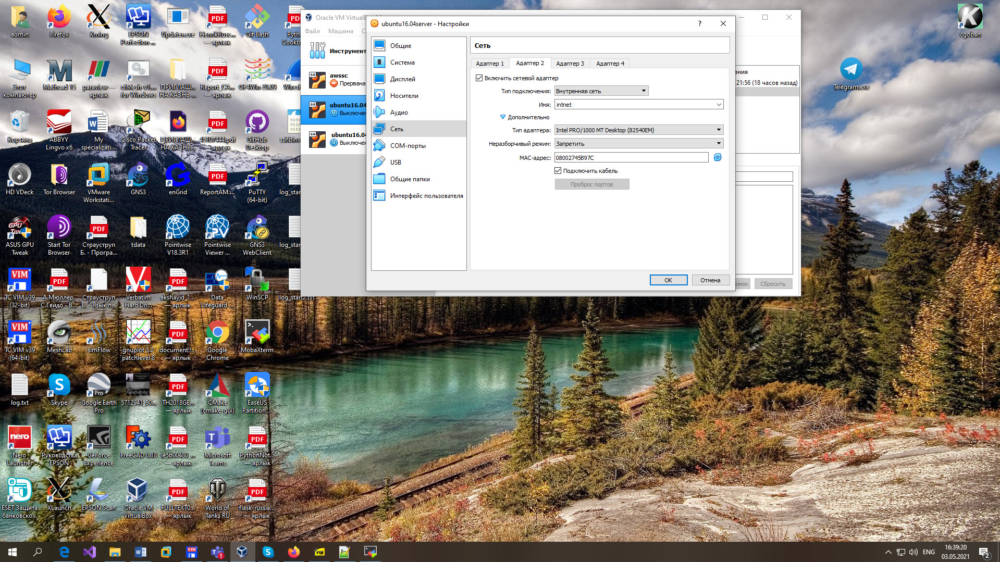

VM1 and VM2 network interfaces is edited.

`sudo nano /etc/network/interfaces`
`sudo systemctl restart networking`
`ip a`

VM1:

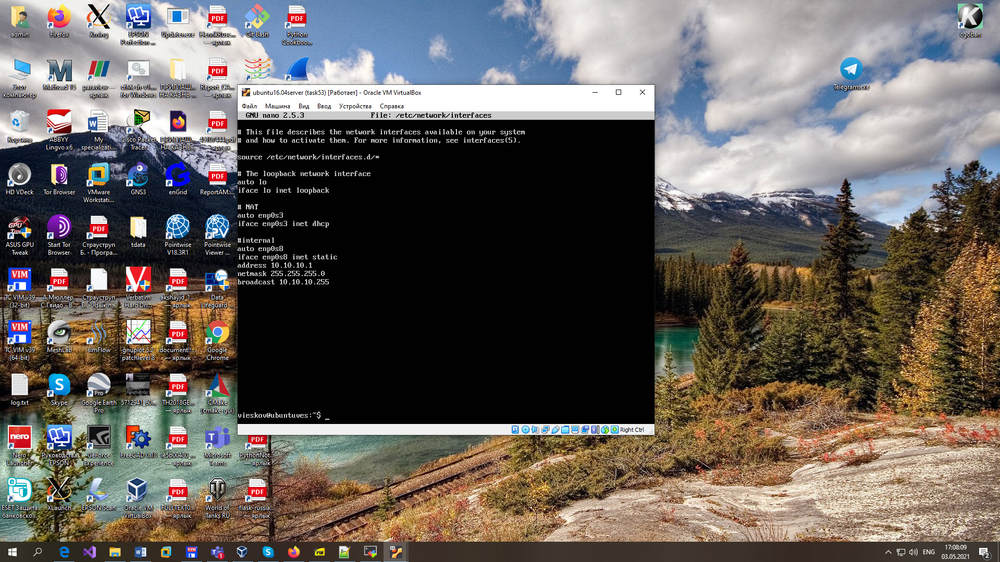

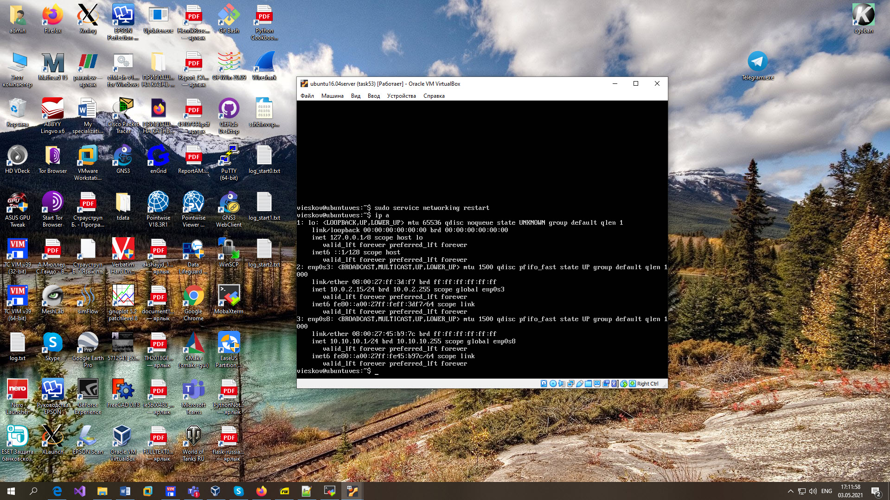

VM2:

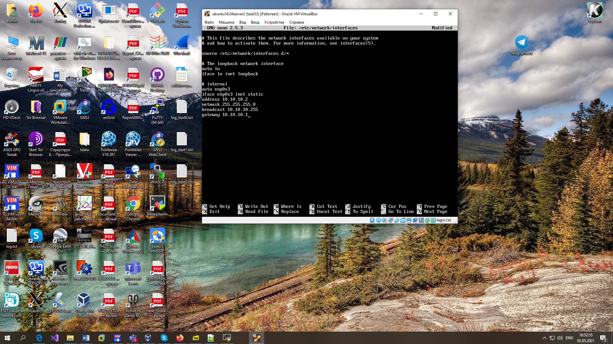

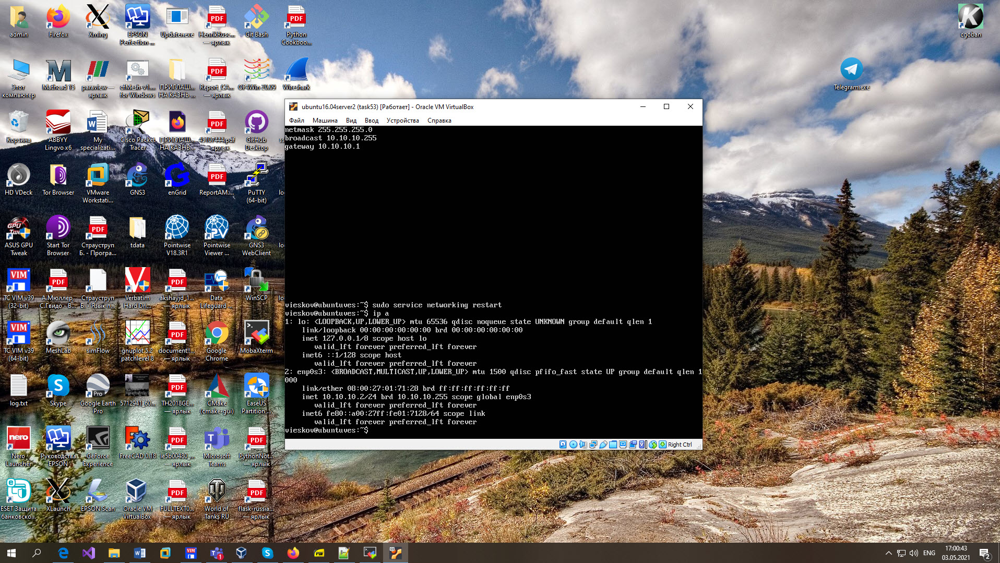

IP forwarding is permitted.

`iptables` is configured.

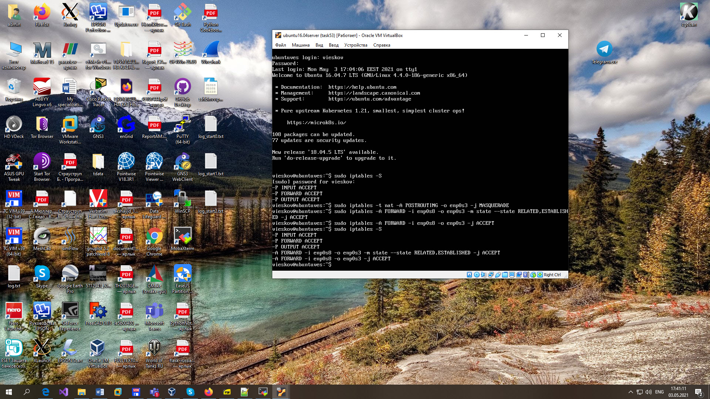

`iptables` settings is saved. 

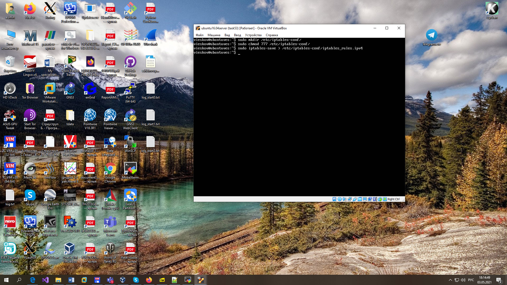

3. Check the route from VM2 to Host.

See next screenshot.

4. Check the access to the Internet, (just ping, for example, 8.8.8.8).

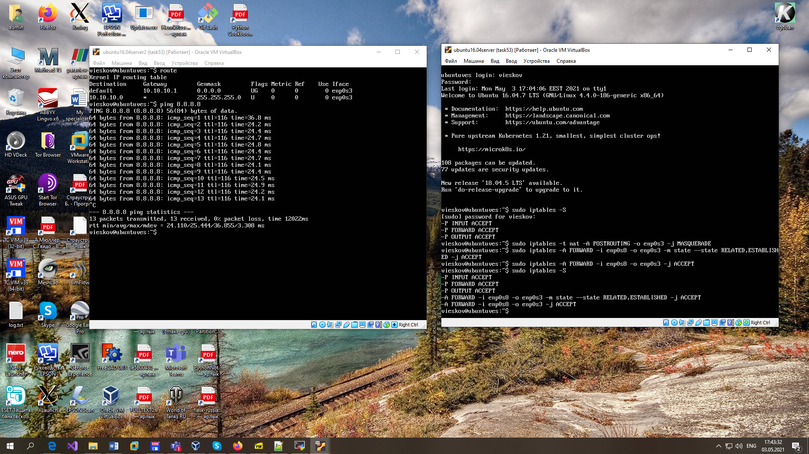

5. Determine, which resource has an IP address 8.8.8.8.

`host 8.8.8.8`

8.8.8.8 is a domain name pointer dns.google.

6. Determine, which IP address belongs to resource epam.com.

`host www.epam.com`

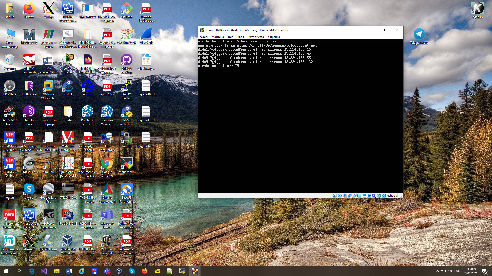

`dig www.epam.com`

`nslookup www.epam.com`

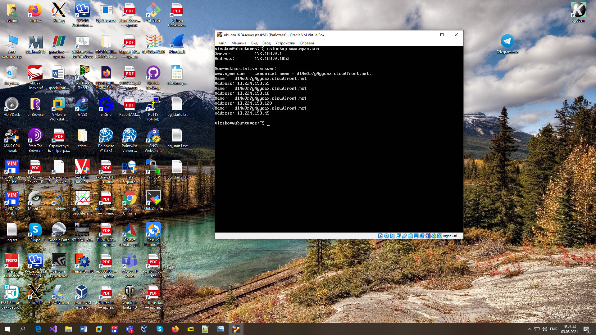

7. Determine the default gateway for your HOST and display routing table.

`netstat -r`

Default gateway for your HOST and display routing table:

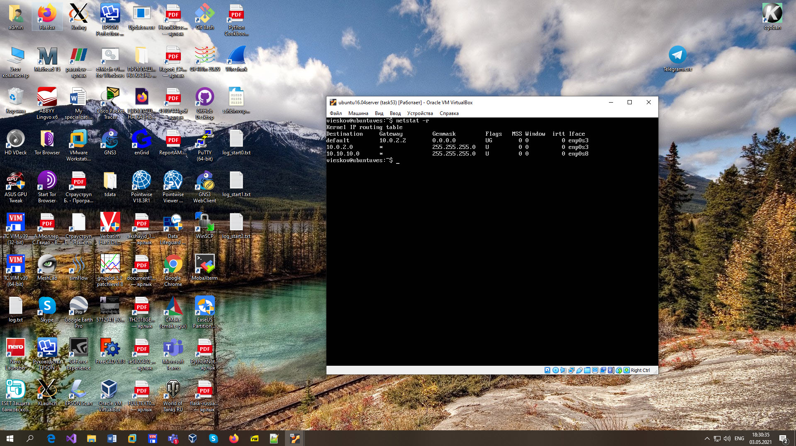

8. Trace the route to google.com.

`traceroute www.google.com`

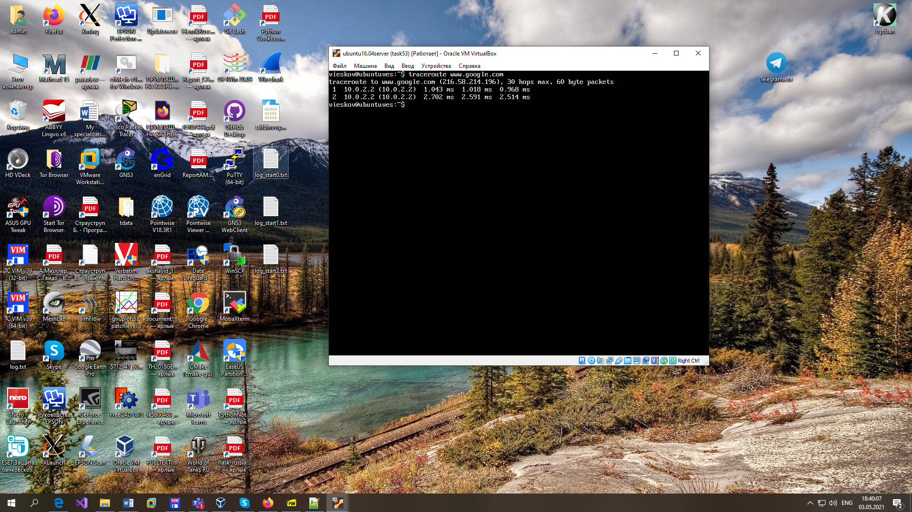

