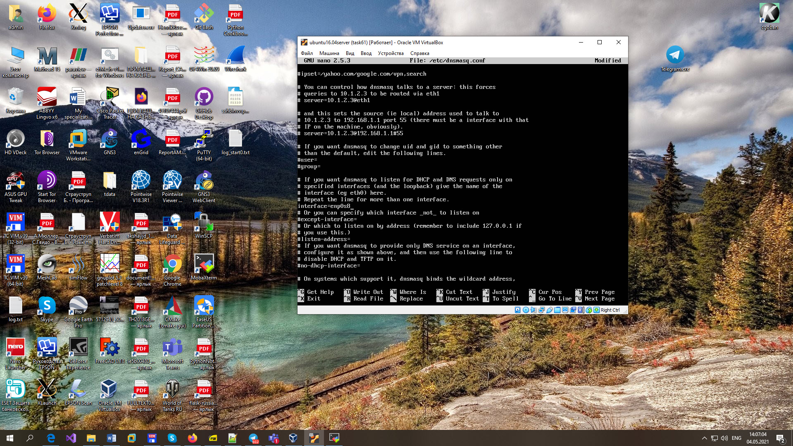
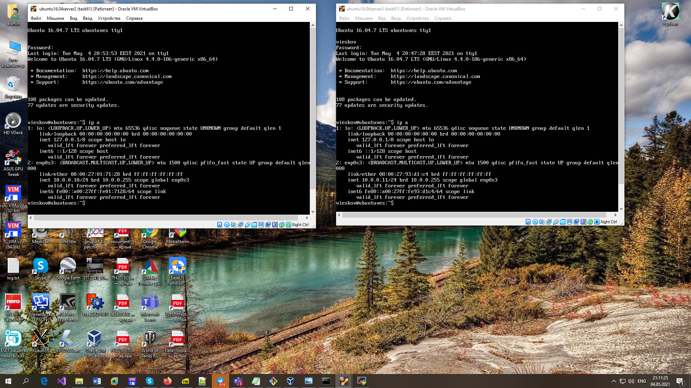
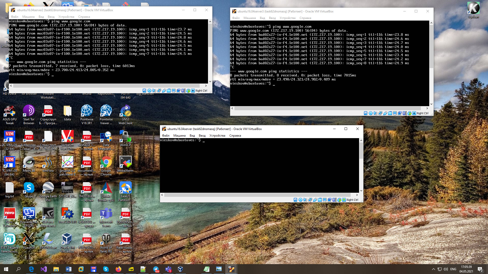

# EPAM University Programs
# DevOps external course
# Module 6  Networking with Linux
# TASK 6.2

## Configuring DHCP, DNS servers and dynamic routing using OSPF protocol

1. Use already created internal-network for three VMs (VM1-VM3). VM1 has NAT and internal,
VM2, VM3 – internal only interfaces.

Virtual machine VM3 is cloned from VM2 from task 6.1.

2. Install and configure DHCP server on VM1.
(3 ways: using VBoxManage, DNSMASQ and ISC-DHCPSERVER).
You should use at least 2 of them.

DHCP servers VBoxManage dhcp, DNSMASQ, ISC-DHCPSERVER  is installed 
and configured on different Virtual Box's snapsots.

**DNSMASQ**

DHCP server on VM1 is installed (DNSMASQ).

DHCP server on VM1 is configured (DNSMASQ).

Interfaces on VM2 and VM3 is edited.

**ISC-DHCPSERVER**

DHCP server on VM1 is installed (ISC-DHCPSERVER).

DHCP server on VM1 is configured (ISC-DHCPSERVER).

<https://ixnfo.com/ustanovka-i-nastroyka-isc-dhcp-server-v-ubuntu.html>

**ISC-DHCPSERVER start failed**

**Virtual Box DHCP**

Network state before configuration.

Virtual Box DHCP server  is configured.

3. Check VM2 and VM3 for obtaining network addresses from DHCP server.

Check DNSMASQ:

Check Virtual Box DHCP:

4. Using existed network for three VMs (from p.1) install and configure DNS server on VM1. (You can
use DNSMASQ, BIND9 or something else).

DNS server DNSMASQ is configured.

5. Check VM2 and VM3 for gaining access to DNS server (naming services).

Access to DNS server  is checked.

6. ***Using the scheme which follows, configure dynamic routing using OSPF protocol.

7. Check results.

Result is checked (DNSMASQ)

