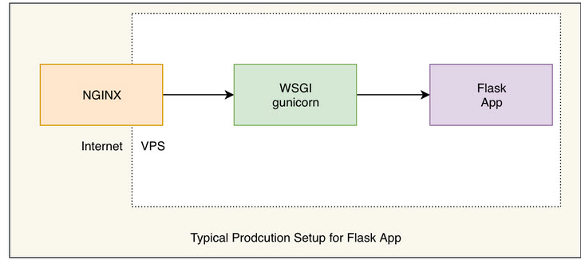
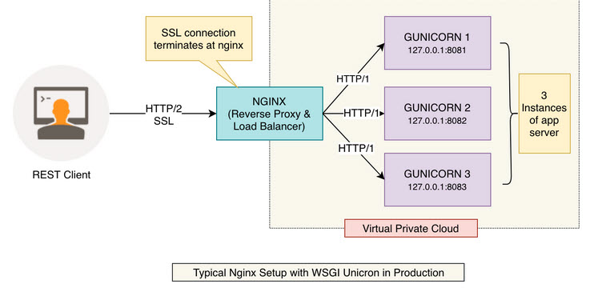
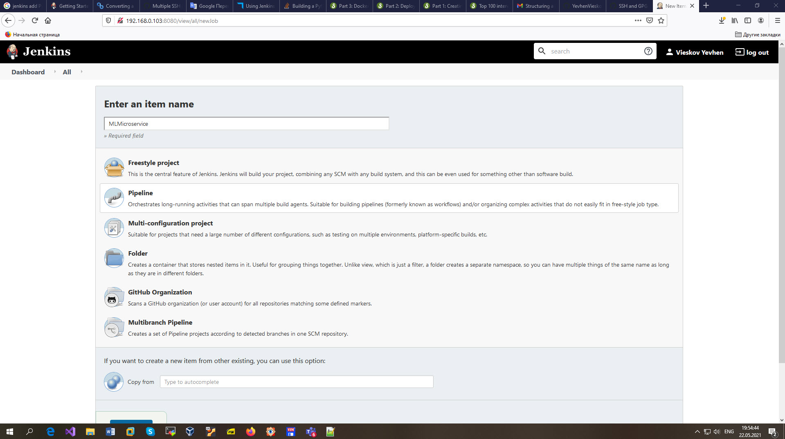

# EPAM University Programs
# DevOps external course
# Module 8  CI/CD
# TASK 8.1

## Jenkins Task
Create some templates using lection materials about Jenkins according your final task.
More detailed: choose the content part for your final task (simple web page, web application, etc) and
programming language (java, js, python, etc), and type of delivery/deployment mechanism.

Mashine Learning Flask Microservice with NGINX Load Balancer is deployed with Jenkins.

GitHub repository with mashine learning microservice is created

SSH key for Jenkins connection yo GitHub is created:

SSH key for nonstandard name is added to `~/.ssh/config` 

Jenkins SSH public key is added to GitHub

Jenkins credentials is created.

Jenkins Pipeline Project is created

Jenkins Pipeline Groovy Script [mnist-micro.groovy](./mnist-micro.groovy).

## Links

https://gist.github.com/jexchan/2351996
https://stackoverflow.com/questions/41412964/using-a-non-default-key-name-other-than-id-rsa

https://docs.python-guide.org/dev/virtualenvs/

https://plugins.jenkins.io/github/

https://stackoverflow.com/questions/48032756/building-a-python-web-application-in-jenkins
https://www.stratoscale.com/blog/devops/deploy-jenkins-best-practices-part-1/
https://www.stratoscale.com/blog/devops/using-jenkins-build-deploy-python-web-applications-part-2/
https://www.javacodemonk.com/part-1-creating-and-testing-flask-rest-api-07bf2ac0
https://www.javacodemonk.com/part-2-deploy-flask-api-in-production-using-wsgi-gunicorn-with-nginx-reverse-proxy-4cbeffdb
https://www.javacodemonk.com/flask-in-production-part-3-6f14a256

https://www.stratoscale.com/blog/devops/why-consider-a-microservices-architecture/?ban=blog_banner1

https://stackoverflow.com/questions/60681521/deploying-a-python-flask-application-with-jenkins-and-executing-it
https://stackoverflow.com/questions/60746018/best-practices-how-to-use-ci-cd-to-deploy-flask-webapp-to-digital-ocean
https://stackoverflow.com/questions/62644372/how-do-i-tell-jenkins-to-run-a-python-flask-application-then-selenium-tests-th
https://stackoverflow.com/questions/63525954/use-jenkins-container-to-build-dockerfile-and-deploy-flask-app

https://gist.github.com/ljaraque/44872caaf7dc56de851f9696b102fa5b
