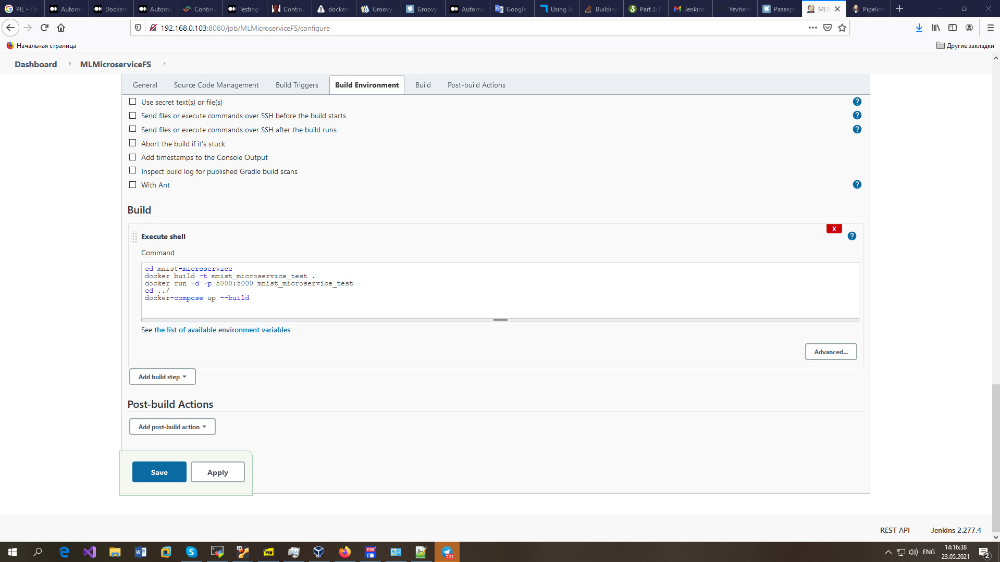

# EPAM University Programs
# DevOps external course
# Module 8  CI/CD
# TASK 8.1

## Jenkins Task
Create some templates using lection materials about Jenkins according your final task.
More detailed: choose the content part for your final task (simple web page, web application, etc) and
programming language (java, js, python, etc), and type of delivery/deployment mechanism.

Mashine Learning Flask Microservice with NGINX Load Balancer is deployed with Jenkins.

As you know, setting up and training machine learning models is only one part of the development cycle,
an equally important part is deploying the model for its further use.
In this article, I will talk about how a machine learning model can be deployed as a Docker microservice,
as well as how you can parallelize the work of a microservice using load balancing across multiple threads
via Load balancer. Recently, Docker has gained a lot of popularity, however, only one of the types of model
deployment strategies will be described here, and in each case, the choice of the best option remains with the developer. 

For this example, I used the popular MNIST dataset. The final ML model will be deployed in a Docker container, access
to which will be organized via the HTTP protocol using a POST request (REST API architectural style). The resulting
microservice will be parallelized through an Nginx-based load balancer.

The Flask web framework already contains a web server, however, it is used strictly for dev purpose only, i.e. for development
only, so I used the Gunicorn web server to provide our REST API. 

GitHub repository with mashine learning microservice is created.

SSH key for Jenkins connection yo GitHub is created:

SSH key for nonstandard name is added to `~/.ssh/config` 

Jenkins SSH public key is added to GitHub

Jenkins credentials is created.

General settings for Jenkins free-style project.

Jenkins Source Code Management set up.

Jenkins Build Triggers.

Jenkins build execute shell.

Jenkins configuration for deployment on Virtual Mashine with nginx and docker.

Success.

`sudo usermod -aG docker jenkins`

Now we restart, and try to build. It should show the image building process.

Jenkins Project build Log: [jenkins-fs_project_build_error.log](./jenkins-fs_project_build_error.log).

Jenkins Pipeline Project is created.

Jenkins Pipeline Groovy Script [mnist-micro.groovy](./mnist-micro.groovy).

## Links

https://gist.github.com/jexchan/2351996
https://stackoverflow.com/questions/41412964/using-a-non-default-key-name-other-than-id-rsa

https://docs.python-guide.org/dev/virtualenvs/

https://plugins.jenkins.io/github/

https://angellom.medium.com/build-a-docker-image-out-of-a-flask-project-6b22122ff0f0
https://angellom.medium.com/automatically-building-a-flask-docker-image-on-git-push-with-jenkins-5a30c9fc9beb
https://medium.com/@anirbanroydas/testing-microservice-written-in-python-flask-with-continuous-integration-delivery-and-deployment-1999fef560a8
https://semaphoreci.com/community/tutorials/continuous-deployment-of-a-python-flask-application-with-docker-and-semaphore

https://stackoverflow.com/questions/48032756/building-a-python-web-application-in-jenkins
https://www.stratoscale.com/blog/devops/deploy-jenkins-best-practices-part-1/
https://www.stratoscale.com/blog/devops/using-jenkins-build-deploy-python-web-applications-part-2/
https://www.javacodemonk.com/part-1-creating-and-testing-flask-rest-api-07bf2ac0
https://www.javacodemonk.com/part-2-deploy-flask-api-in-production-using-wsgi-gunicorn-with-nginx-reverse-proxy-4cbeffdb
https://www.javacodemonk.com/flask-in-production-part-3-6f14a256

https://www.stratoscale.com/blog/devops/why-consider-a-microservices-architecture/?ban=blog_banner1

https://stackoverflow.com/questions/60681521/deploying-a-python-flask-application-with-jenkins-and-executing-it
https://stackoverflow.com/questions/60746018/best-practices-how-to-use-ci-cd-to-deploy-flask-webapp-to-digital-ocean
https://stackoverflow.com/questions/62644372/how-do-i-tell-jenkins-to-run-a-python-flask-application-then-selenium-tests-th
https://stackoverflow.com/questions/63525954/use-jenkins-container-to-build-dockerfile-and-deploy-flask-app

https://gist.github.com/ljaraque/44872caaf7dc56de851f9696b102fa5b
